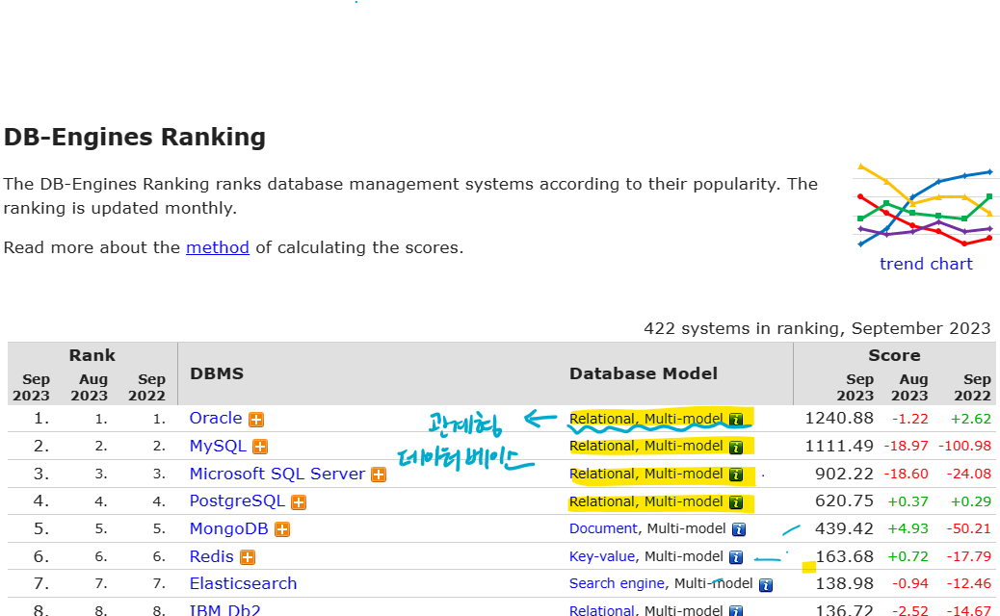

<h5>데이터 베이스의 핵심</h5>
* <B>C</B>reate   <B>R</B>ead   <B>U</B>pdate   <B>D</B>elete
* input - Create/Update/Delete	
* output - Read

<h5>데이터 베이스 시장 현황</h5>

>데이터베이스 시장의 절대 강자는 `관계형데이터 베이스`

* Oracle : 오래된 데이터 베이스. 자급력 있는 기업이나 정부에서 보통 사용. 비용이 비쌈.

* MySQL : 무료. 작은 기업,  SNS 대규모데이터지만 신뢰성은 중요하지 않은 경우.

* MongoDB  : 관계형 데이터베이스가 아니기 때문에 데이터 베이스의 대한 이해와 폭을 넓히기 위해 배워 둘 것.

  

<h5>데이터 베이스는 왜 사용하는가?</h5>

* 데이터의 관리 : 파일 -> 스프레드 시트 -> 데이터베이스

* 스프레드 시트 : 사용자의 직접 조작 필요.

* 데이터 베이스 : 컴퓨터의 언어로 데이터를 관리. 

  

<h5>데이터베이스 특징</h5>

* 스키마(데이터베이스) : 서로 연관된 데이터들을 Groupping 해준다.
* 데이터베이스는 자체적으로 보안체제를 가지고 있음
* 사용자별로 권한 설정이 가능하다.
* 일반적으로 'root'는 모든 권한이 있음.

<h5>SQL : Structured Query Language</h5>

* Structured - 표로 정리해서 구조화

* Query - 데이터베이스에게 요청,질의한다.  라는 의미.

* 행 == row == record  == 데이터 하나하나

* 열 == column == dataTYPE

  
