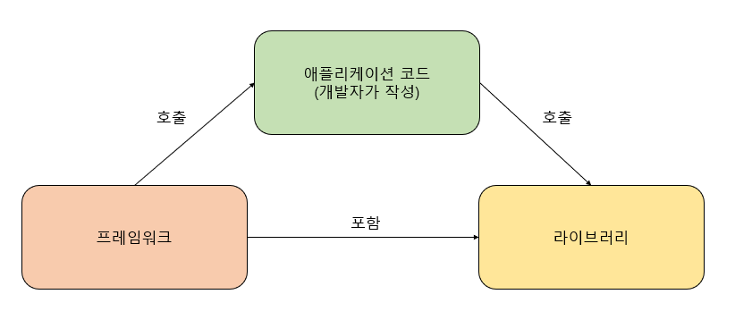

## 라이브러리와 프레임워크의 차이

1. 프레임워크
* 애플리케이션 개발 시 필수적인 코드, 알고리즘, DB 커넥션 등을 위한 뼈대
* 설계와 구현을 재사용이 가능한 클래스와 인터페이스의 집합
* JAVA - SPRING / PYTHON - DJANGO 등 

2. 라이브러리
* 개발 할 때 프로그램이 사용하는 비휘발성 자원 모임
* 구성 데이터, 문서, 도움말, 메시지 틀, 미리 작성된 코드, 함수 , 클래스 ,값, 자료형 사양 등등 포함.
* 재사용이 가능한 기능을 미리 구현 -> 필요한 곳에서 호출
* ex) Junit, Lombok
* ex) Spring 프레임워크의 내부 라이브러리 : Spring Boot, Spring JDBC, Spring MVC 등

3. 프레임워크와 라이브러리의 차이

* 비유 
  * 프레임워크 : 모델하우스
  * 라이브러리 : 이케아에서 산 재료로 가구를 조립
  

* **제어역전? 제어흐름?**
  * 프레임워크
    * 프레임워크는 전체적인 흐름을 쥐고 있음
    * 제어의 역전의 개념이 적용돼있음
    * 프레임워크에 제어의 흐름을 넘겨 개발자가 작성하는 코드에서 신경써야 할 부분을 줄임
    * 애플리케이션의 코드는 프레임워크가 짜놓은 틀 안에서 수동적으로 동작.

  * 라이브러리
    * 개발자가 전체적인 흐름을 만듦.
    * 개발자가 필요할 때 마다 능동적으로 라이브러리를 호출하여 사용.
  

> 참조 
> * https://code-lab1.tistory.com/284
> * https://velog.io/@whitecloud94/%ED%94%84%EB%A0%88%EC%9E%84%EC%9B%8C%ED%81%AC-vs-%EB%9D%BC%EC%9D%B4%EB%B8%8C%EB%9F%AC%EB%A6%AC

## GIT

### Branch 

### Merge

### Pull Request

### VCS 의 개념

### main(master/production) 브랜치와 dev(development) 브랜치를 분리하는 이유

### Commit Message

## RESTful API - 정의/개념 및 장단점

## API Endpoint

## Postman 사용법

## React / Spring 프로젝트 생성해보기

(기본 코드가 제공되니 가능하면 실행까지 해보길 권장)

## 포트 번호 (기본값)

* React - localhost : 3000
* Spring - localhost : 8080