## 개념

### Cloud Insight

* 위젯 설정으로 나만의 모니터링 화면을 커스텀 가능

### Sub Account

(혼자 쓸 경우 master계정 사용해도 됨.)

* 외국 클라우드 서비스에서는 (리눅스 등) root나 UAC권한을 주지 않음. 

* 협업시에는 권한과 책임에 맞게 계정을 부여 → Sub Account 이용 

* 2차 인증 가능

#### 서비스를 만들 때 중요한 사항

1. 백업

2. 보안
   * ACG에서는 Service 포트만 열어야 함
   * Server에 접속할 때는 SSL-VPN을 이용해서 접속
   * Server에는 root 접근을 차단 → user add로 일반계성 생성 후 이용 

방화벽 설정보다 더 중요.

#### Cloud Activity Tracer

* 계정 활동 로그 수집
* Sub Account가 생성돼 있어야 이용 가능한 서비스.

### Web service Monitoring System (191p)

* 키워드 기억하기 : `스케쥴`, `시나리오기반`

* 시나리오?
  * 테스트를 보는 것으로 그치지 않고 클릭 등 액티브한 테스트를 모아서 등록 후 그 결과를 확인하는 것.

### Cloud Advisor

* 클라우드를 잘 활용하고 있는지 진단.
* 주로 보안과 관련된 기능이 많음

### Cloud Log Analytics

* 용량이 100GB 제한. 용량 초과 시 30% 정도의 데이터가 삭제됨.
* 보관 기간 1달. 기간 초과시  삭제됨

---

## 실습

### 모니터링

상품마다 모니터링 서비스를 지원함.

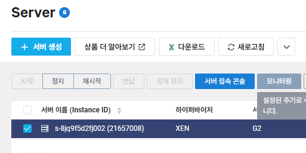

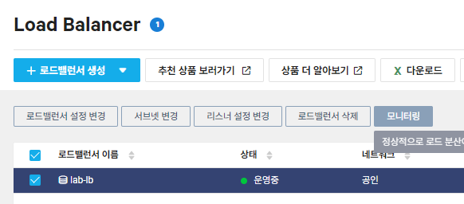

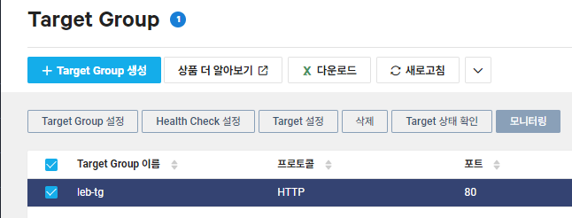

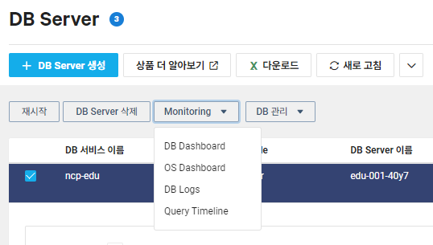

### Cloud Insight

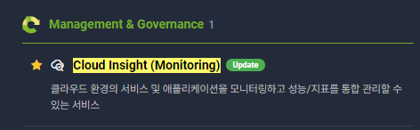

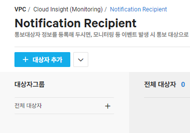

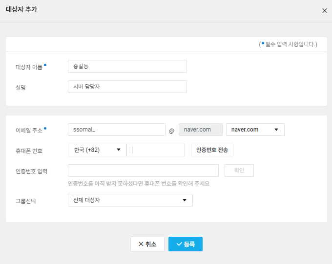

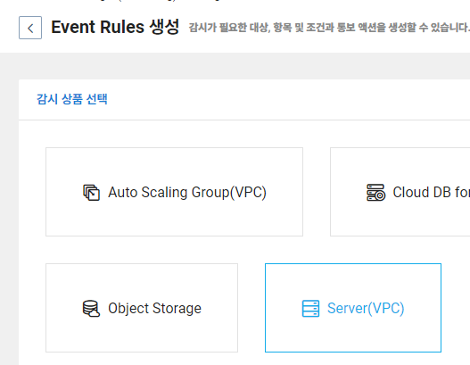

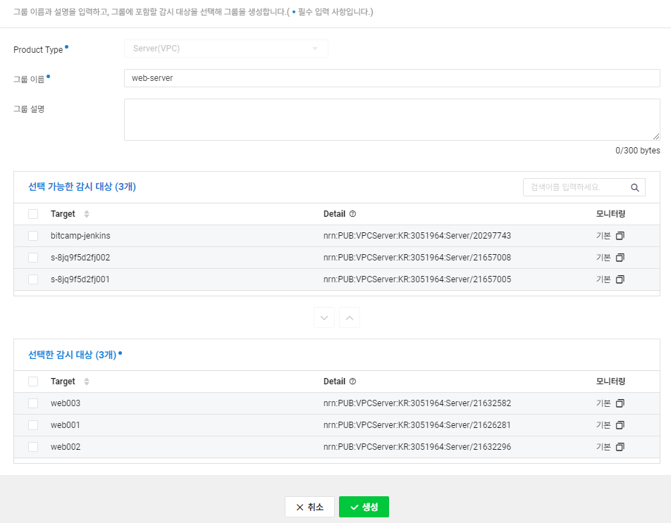

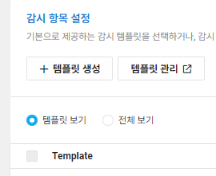

템플릿 생성하기

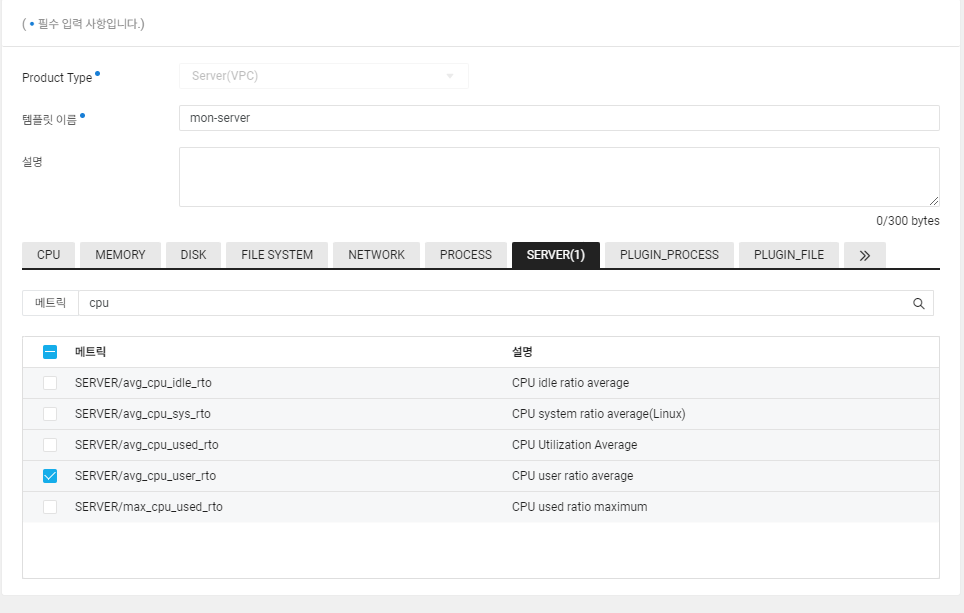

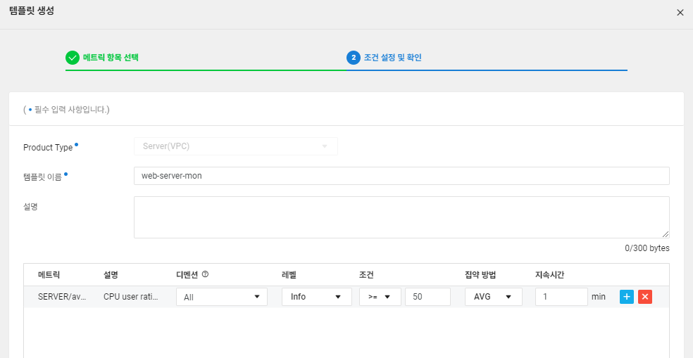

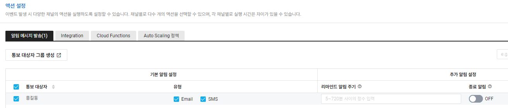

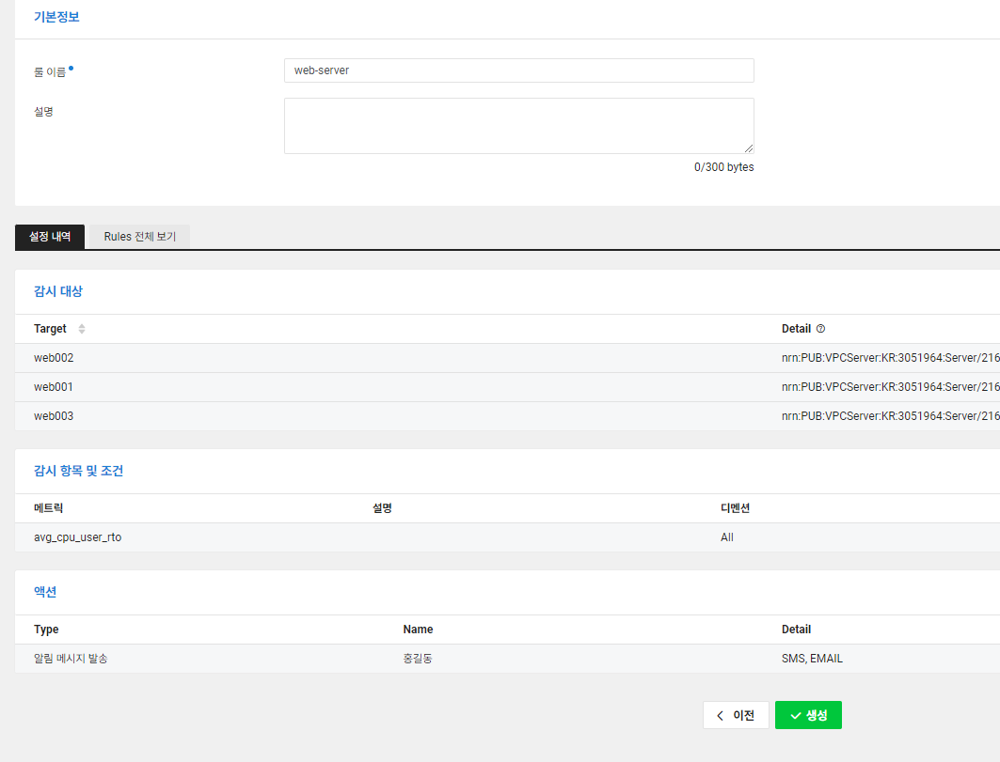

#### 결과

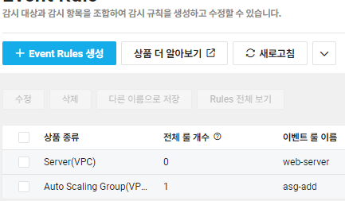

