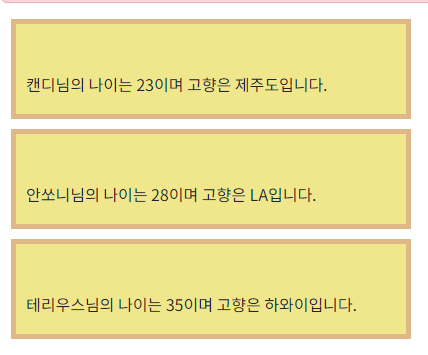

### useRef

* useRef : 값이 변경돼도 화면이 다시 랜더링되지 않음 
  * 값이 변경 시 화면에 바로 적용되는 state와는 달리 당장 화면에 출력할 필요없이 내부적인 값만 바뀌면 되는 경우에 사용한다. 
  * 새로고침 시 변경된 값을 확인할 수 있다.

```js
//1. state
const [count, setCount] = useState(0);

//2. useRef
const countRef = useRef(0);
```

```js
<Button variant='outlined' color='success' size='small'
                    onClick = {()=>setCount(count + 1)}> 
  count 변수 증가</Button>

<Button variant='outlined' color='primary' size='small'
        onClick = {() => {
          countRef.current = countRef.current + 1;
          // 화면에 바로 보이지 않기 때문에 콘솔로 확인하기.
          console.log("countRef.current" + countRef.current);
        }}> 
  useRef 변수 증가</Button>
```

### useRef를 이용해서 값 입력하기

#### 상수 선언

```js
const [msg, setMsg] = useState('');
const nameRef = useRef('');
const korRef = useRef(0);
const engRef = useRef(0);
```

#### 폼생성

```js
  <tr>
    <th style={{width:'100px'}}>이름</th>
    <td><input type='text' className='form-control' ref={nameRef}/></td>
  </tr>
  <tr>
    <th style={{width:'100px'}}>국어 점수</th>
    <td><input type='text' className='form-control' ref={korRef}/></td>
  </tr>
  <tr>
    <th style={{width:'100px'}}>영어 점수</th>
    <td><input type='text' className='form-control' ref={engRef}/></td>
  </tr>
  <tr>
    <td colSpan={2} align='center'>
      <Button color = 'info' variant='outlined' onClick ={buttonResult}>
        결과 확인
      </Button>
    </td>
  </tr>
  <tr style={{height:'100px'}}>
    <td colSpan={2} style={{whiteSpace:'pre-line', backgroundColor:'aliceblue'}}>
      <h4>{msg}</h4>
    </td>
  </tr>
```

#### 버튼이벤트

```js
const buttonResult = ()=> {
    
        //value를 붙여야함에 유의!!
        let name = nameRef.current.value;
        let kor = korRef.current.value;
        let eng = engRef.current.value;
        
        //숫자인지 확인 후 경고
        if (isNaN(kor) || isNaN(eng)) {
            alert("점수는 숫자로 입력해 주세요.")
            return;
        }
        
        //총점, 평균
        let total =  Number(kor) + Number(eng);
        let avg =  total / 2;
        
        //whiteSpace:'pre-line' 가 적용돼있어 작성한 그대로 줄바꿈되어 출력됨.
        let s = 
            `
            이름 : ${name}
            국어 점수 : ${kor}
            영어 점수 : ${eng}
            총점 : ${total}
            평군 : ${avg}
            `;
        
        setMsg(s);  //state변수 msg에 값 넣기
        
        //입력값 초기화
        nameRef.current.value = '';
        korRef.current.value = '';
        engRef.current.value = '';
        nameRef.current.focus = '';
    }
```

점수를 입력할 때에는 렌더링이 일어나지않으며, 버튼을 눌렀을 때에민 렌더링 실행됨.

(state변수였다면 즉시 렌더링 반영됨.)

### 하나의 변수에 여러 데이터 저장하기

상수선언

```js
const [inputArray, setInputArray] = useState([]);

//객체를 갖는 상태 변수
const [inputs, seetInputs] = useState({
  name:'',
  nickName:'',
  hp:'',
  addr:''
})
```


```js
<input type='text' className='form-control' value = {inputs.name} name='name'/>
<input type='text' className='form-control' value = {inputs.nickName} name='nickName'/>
<input type='text' className='form-control' value = {inputs.hp} name='hp'/>
<input type='text' className='form-control' value = {inputs.addr} name='addr'/>

<Button color='info' variant='outlined'>배열에 추가</Button>
<Button color='info' variant='outlined'>입력값 초기화</Button>

<div style={{width:'450px'}}>
  출력 <br/>
  name : {inputs.name}<br/>
  nickName : {inputs.nickName}<br/>
  hp : {inputs.hp}<br/>
  addr : {inputs.addr}<br/>
</div>
```

#### 입력시 inputs의 해당 멤버변수로 값이 들어가게 하기 위한 이벤트

```js
const inputChangeEvent = (e)=> {
    const {name, value} = e.target; //Change된 이벤트 태그의(현재는 input) 속성인 name 과 value 값을 얻음.

    setInputs({
        ...inputs,       // 1. 기존의 값을 펼침 연산자로 일단 넣고
        [name] : value   // 2. 입력한 태그의 name에 값 변경
    })
}
```

input에 onChange 함수 등록

```js
이름<input type='text' className='form-control' value = {inputs.name} name='name' onChange={inputChangeEvent}/>
닉네임<input type='text' className='form-control' value = {inputs.nickName} name='nickName' onChange={inputChangeEvent}/>
연락처<input type='text' className='form-control' value = {inputs.hp} name='hp' onChange={inputChangeEvent}/>
주소<input type='text' className='form-control' value = {inputs.addr} name='addr' onChange={inputChangeEvent}/>
```


#### 배열 추가 이벤트 

```js
const addArrayEvent = () => {
    //기존 배열 데이터에 묶음 변수인 inputs 추가
    setInputArray(inputArray.concat(inputs));
}
```

#### 입력값 초기화

```js
const clearFormEvent = ()=> {
    setInputs({
        name:'',
        nickName: '',
        hp: '',
        addr : ''
    })
}
```

버튼에 적용하기

```
<Button color='info' variant='outlined' onClick = {addArrayEvent}>배열에 추가</Button>
<Button color='info' variant='outlined' onClick = {clearFormEvent}>입력값 초기화</Button>
```


#### 배열 출력

```js
<table className='table table-bordered' style={{width:'500px'}}>
  <caption align='top'>데이터 갯수 : {inputArray.length}</caption>
  <thead>
    <tr>
      <th>이름</th>
      <th>닉네임</th>
      <th>hp</th>
      <th>주소</th>
    </tr>
  </thead>
  <tbody>
    {
      inputArray.map((item, idx)=>
        <tr key={idx}>
          <td>{item.name}</td>
          <td>{item.nickName}</td>
          <td>{item.hp}</td>
          <td>{item.addr}</td>
        </tr>
      )
    }
  </tbody>
</table>
```

#### delete 기능 추가


```js
const deleteData= (deleteIdx) =>{
  setInputArray(inputArray.filter((array, idx) => deleteIdx !== idx));
}
```

```js
<span style={{marginLeft:'10px', cursor:'pointer'}}
   onClick ={(e) => deleteData(idx)}>🗑️</span>
```


### 부모/자식 간 통신

* `D_App` : 부모 앱
* `D_Child_App` : 자식 앱


부모앱에서 자식앱으로 변수값이나 이벤트를 보낼 수 있다. (props를 통해 전달)

자식앱에서 부모앱으로 직접적으로 데이터를 보낼 수는 없음. 단, 이벤트 파라미터를 통해 전달하는 방법이 있다.

대체로는 부모앱가 자식앱에 보냄

**특징 다시 정리**

1. 부모 컴포넌트에서 자식 컴포넌트로 props를 통해서 값이나 이벤트 전달을 할 수 있다.
2. 자식 컴포넌트에서는 부모 컴포넌트의 값을 props 로 받아서 출력은 가능하지만 직접적으로 변경은 불가능하다.
3. 만약 변경하려면 부모의 이벤트를 props를 통해서 호출을 해서 그 이벤트 함수에서 변경을 하면 된다.
4. props 는 부모컴포넌트에서 설정하며, 컴포넌트 자신은 해당 props 를 읽기전용으로만 사용할 수 있다.
5. 컴포넌트 내부에서 읽고 또 업테이트하려면 state를 써야한다.


#### 부모앱 설정

```js
const D_App = (props) => {
  return(
    <div>
      <h3 className='alert alert-danger'>D : 부모, 자식간 통신</h3>
      {/* 아래 속성 name, age, addr 의 값이 props를 통해 전달된다.*/}
      <D_Child_App name={'캔디'} age={23} addr={'제주도'}/>   
      <D_Child_App name={'안쏘니'} age={28} addr={'LA'}/>
      <D_Child_App name={'테리우스'} age={35} addr={'하와이'}/>
    </div>
  )
}

export { D_App }
```

#### 자식앱 설정 방법 1

```js
const D_Child_App = (props) => {
  return(
    <div className='box'>
      {props.name}님의 나이는 {props.age}이며 고향은 {props.addr}입니다.
    </div>
  )
}

export default D_Child_App;  //반드시 default로 되어있어야함.
```

#### 자식앱 설정 방법 2

```js
const D_Child_App = (props) => {

  const {name, age, addr} = props;  //출력만 가능, 수정은 불가능 (읽기전용)

  return(
    <div className='box'>
      {name}님의 나이는 {age}이며 고향은 {addr}입니다.
    </div>
  )
}

export default D_Child_App;
```

#### 결과 




#### 자식앱에서 부모앱이 가진 변수 변경

```js
//부모앱

const changeCount = ()=> {
  setCount(count + 1)
}

return(
  <div>
    <h3 className='alert alert-danger'>D : 부모, 자식간 통신</h3>
    
    <h4>방문 횟수 : {count}회</h4> {/*자식앱에서 변경할 항목 생성 */}
    <D_Child_App name={'캔디'} age={23} addr={'제주도'} incre={changeCount}/>
    <D_Child_App name={'안쏘니'} age={28} addr={'LA'} incre={changeCount}/>
    <D_Child_App name={'테리우스'} age={35} addr={'하와이'} incre={changeCount}/>
  </div>
)
```

```js
//자식앱에서 incre를 받아 사용가능.

<Button color='info' variant='outlined' size='small'
        onClick = {() => props.incre()}>증가</Button>
```


### 테이블에서 행단을 자식앱에서 출력

#### 부모앱 설정

객체형 상수 선언

```js

const [photoArray, setPhotoArray]=useState([
  {
    fname : '망고빙수',
    fphoto : '1.jpg',
    fprice : '12000',
    fdate : new Date()
  },
  {
    fname : '샌드위치',
    fphoto : '10.jpg',
    fprice : '9900',
    fdate : new Date()
  }
])
```

```js
  <table className='table table-bordered' style={{width:'400px'}}>
  <thead>
    <tr style={{backgroundColor:'palegoldenrod'}}>
      <th>번호</th>
      <th>메뉴명</th>
      <th>가격</th>
      <th>날짜</th>
    </tr>
  </thead>
  <tbody>
    {
      photoArray.map((data, idx)=>(
          <E_RowItem row={data} idx={idx}/>
      ))
    }
  </tbody>
</table>
```

#### 자식앱 설정

```js
//                   ↓ props 대신 부모앱에서 설정한 속성을 받도록 설정.
const E_RowItem = ({row, idx}) => {
  return(
    <tr>
      <td>{idx+1}</td>
      <td>{row.fname}</td>
      <td valign='middle'>{row.fprice}</td>
      <td valign='middle'>{row.fdate.toLocaleDateString('ko-KR')}</td>
    </tr>
  )
}
```


### 입력 폼 데이터 전달

```js
//데이터 추가 이벤트 
const dataAdd = (data) => {
    setPhotoArray(photoArray.concat({
        ...data,
        fdate : new Date()
    }))
}
```

```js
{/* 부모앱에 입력 폼 추가*/}
<E_RowItem onSave = {dataAdd()}/>
<br/>
```

```js
//자식앱 

const E_WriteForm = ({onSave}) => {

  const [fname, setFname] = useState('');
  const [fphoto, setFphoto] = useState('2.jpg');
  const [fprice, setFprice] = useState(0);

  const onAddEvent= () => {
    onSave({fname, fphoto, fprice});

    //초기화
    setFname('');
    setFprice(0);
  }

  return(
    <div className='input-group'>
      메뉴명 :
      <input type='text' value={fname} onChange={(e)=> setFname(e.target.value)}
             style={{width:'100px'}} />

      가격 :
      <input type='text'
             value={fprice} onChange={(e)=> setFprice(e.target.value)} style={{width:'70px'}} />

      사진 :
      <select onChange={(e)=> setFphoto(e.target.value)}>
        <option value={'2.jpg'}>사진1</option>
        <option value={'12.jpg'}>사진2</option>
        <option value={'15.jpg'}>사진3</option>
      </select>
      <Button color='warning' varuabt='outlined' size = "small" onClick ={onAddEvent}>추가</Button>
    </div>
  )
}
```


### 데이터 삭제

```js
//부모앱 

const deleteData = (deleteIdx) => {
  setPhotoArray(photoArray.filter((array, idx) => deleteIdx !== idx));
}
```


#### 자식앱으로 데이터 전달 

```js
<tbody>
  {
    photoArray.map((data, idx)=>(<E_RowItem row={data} idx={idx} 
                                            onDelete={deleteData}/>))
  }
</tbody>
```

#### 부모앱 onDelete 호출

```js
const E_RowItem = ({row, idx, onDelete}) => {
    ....
  <td valign='middle'>
    <span style={{curser:'pointer'}} onClick={()=> onDelete(idx)}>🗑️</span> ️
  </td>
}
```


### json데이터 출력

```js
{
    "navData": [
        {
        "img" : "https://image.ohou.se/image/resize/bucketplace-v2-development/uploads-shortcut-home_feed_shortcut_sets-166485672496321483.png/512/none",
        "title" :  "쇼핑하기"
    }, 
    {
        "img" : "https://image.ohou.se/image/resize/bucketplace-v2-development/uploads-shortcut-home_feed_shortcut_sets-166528077592274715.png/512/none",
        "title" : "의식주예고"
    },
    {
        "img" : "https://image.ohou.se/image/resize/bucketplace-v2-development/uploads-shortcut-home_feed_shortcut_sets-166485696782888460.png/512/none",
        "title" :  "오늘의딜"
    }, 
]
}
```

```js
const navData = cate.navData;

//이미지에 적용할 ref 변수 선언
const mainPhotoRef = useRef(null);
```

```js
 <div className='nav_container'>
  <ul className='nav_category'>
    {
      navData.map((item, idx) =>
        <li key = {idx}>
          <div> {
                      mainPhotoRef.current.src = e.target.src;
                    }}/></div>
          <div style={{textAlign:'center'}}>{item.title}</div>
        </li>
      )
    }
  </ul>
</div>

{/* 아이콘 클리시  작은 이미지를 가져와서 출력할 메인 이미지*/}
<div>
  
</div>
```

