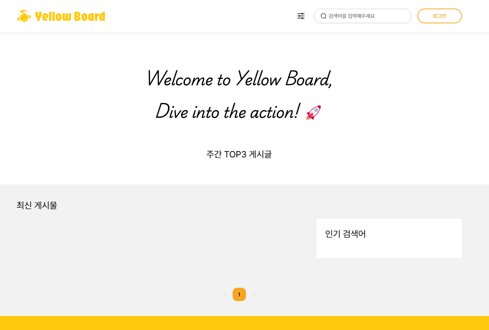


나만의 취업 노트 만들기


  

# ✨About Me

    

    
    

    

        

            <h2>이 소 연 Lee soyeon</h2>
        

        

                wxy890@gmail.com
        

        

            

            

            

            

                    
                    ↓ 이력서 다운받기 
            

        

    

>  Introduce 

* 백엔드 / 프론트엔드 / DB설계 / 배포 경험이 있습니다.
* 코드의 가독성과 명확한 네이밍에 많은 노력을 기울입니다.
* 빠르고 효율적으로 데이터를 얻기 위한 아키텍쳐를 구상하는 것에 흥미를 느낍니다.
* 사용자(또는 동료) 친화적인 결과물을 도출하기 위한 고민을 합니다.

 

## ▪️ DevCourse

`네이버 × 비트캠프`에서 주관하는 [웹 개발자 교육🌐](/devl)을 수료하였으며, 현재 비트캠프 `AWS 프로젝트 코스`를 진행중입니다. 동시에 `항해99 취업 리부트` 코스를 진행하며 계속 개발 공부를
하고있습니다. - 2024.07.09

 

<table>
  <tr>
    <th style="text-align: center; vertical-align: middle;">Program</th>
    <th style="text-align: center;">Content</th>
    <th style="text-align: center; vertical-align: middle;">Status</th>
  </tr>
  <tr>
    <td style="text-align: center; vertical-align: middle;">
      <b>항해99 취업리부트</b> 24.07 ~ 24.10 (10주)
    </td>
    <td style="text-align: left;">
     - 자료구조 & 알고리즘 
     - 대기업 시나리오 프로젝트  
    </td>
    <td style="text-align: center; vertical-align: middle;">진행중</td>
  </tr>
  <tr>
    <td style="text-align: center; vertical-align: middle;">
      <b>AWS 데브옵스 웹개발</b> 24.06 ~ 24.07 (4주)
    </td>
    <td style="text-align: left;">
     - 도커 컴포즈를 활용하여 AWS 배포 
     - EUREKA SEVER 아키텍쳐, SOLID 원칙  
     - 자율 프로젝트 
    </td>
    <td style="text-align: center; vertical-align: middle;">진행중</td>
  </tr>
  <tr>
    <td style="text-align: center; vertical-align: middle;">
      <b>네이버 데브옵스 웹개발</b> 23.08 ~ 24.03 (약 6개월)
    </td>
    <td style="text-align: left;">
     - 웹 어플리케이션 개발 팀 프로젝트 
     - 개발자를 위한 DevOps 
     - NCP DB & 스토리지 
     - 도커 컨테이너 애플리케이션 배포 
     - 운영자를 위한 DevOps
    </td>
    <td style="text-align: center; vertical-align: middle;">`수료` </td>
  </tr>
</table>

 

## ▪ Skills

 


Back-end & Ops


|                                                               |                                                                                                                                                                                       |
|:--------------------------------------------------------------|:--------------------------------------------------------------------------------------------------------------------------------------------------------------------------------------|
| <i class="devicon-java-plain"></i> JAVA                       | OOP, 스트림API,컬렉션 프레임워크(List, Map), 불변성 유지(record, Builder패턴)                                                                                                                        |
| <i class="devicon-spring-original"></i> Spring Boot           | 애플리케이션 개발                                                                                                                                                                             |
| <i class="devicon-spring-original"></i> Spring MVC            | 웹 애플리케이션 개발                                                                                                                                                                           |
| <i class="devicon-hibernate-plain"></i> JPA / MyBatis         | 데이터베이스 연동, CRUD 작업, 엔티티 매핑                                                                                                                                                            |
| <i class="devicon-spring-original"></i> Spring Security & JWT | 인증 및 권한부여                                                                                                                                                                             |
| 데이터베이스                                                        | <i class="devicon-mysql-original"></i> MySQL　<i class="devicon-redis-plain"></i> Redis                                                                                               |
| 도구 및 환경                                                       | <i class="devicon-gradle-original"></i> Gradle　<i class="devicon-maven-plain"></i> Maven　<i class="devicon-docker-plain"></i> Docker　<i class="devicon-github-original"></i> GitHub |
| 테스트 및 품질관리                                                    | <i class="devicon-junit-plain"></i> JUnit, Slf4j                                                                                                                                      |

 


Front-end


|   |                                                                                                                                                                 |
|:------------|:----------------------------------------------------------------------------------------------------------------------------------------------------------------|
| 언어          | <i class="devicon-javascript-plain"></i> JavaScript 　 <i class="devicon-typescript-plain"></i> TypeScript                                                       |
| 마크업& 스타일 시트 | <i class="devicon-html5-plain"></i> HTML5　<i class="devicon-css3-plain"></i> CSS3                                                                               |
| 프레임워크       | <i class="devicon-react-original"></i> React                                                                                                                    |
| 상태 관리       | Recoil          |
| 도구 및 환경     | <i class="devicon-npm-original-wordmark"></i> npm　 <i class="devicon-yarn-original"></i> yarn                                                                   |

 


Tools


<i class="devicon-intellij-plain"></i> Intelli J 　 <i class="devicon-trello-plain"></i> Trello 　 <i class="devicon-slack-plain"></i> Slack 　 <i class="devicon-figma-plain"></i> Figma 　 <i class="devicon-jira-plain"></i> Jira 　 <i class="devicon-confluence-plain"></i> Confluence

 

>  Certifications 

* **SQLD** (SQRD 자격) - 2023.11

[//]: # (* **정보처리기사** &#40;필기&#41; - 2024.07)

 

---

# ✨Project

## ▪ [Cherry Weather](/about/cw/)


체리웨더는 날씨를 기반 커뮤니티 추천 + AI를 이용한 복장 추천 서비스입니다. 
[️[→ 프로젝트 상세 보기]](/about/cw)


 

## ▪ YellowBoard


옐로우보드는 블로그형 커뮤니티 서비스입니다. 
[️[→ 프로젝트 상세 보기]](/about/yb)


---

