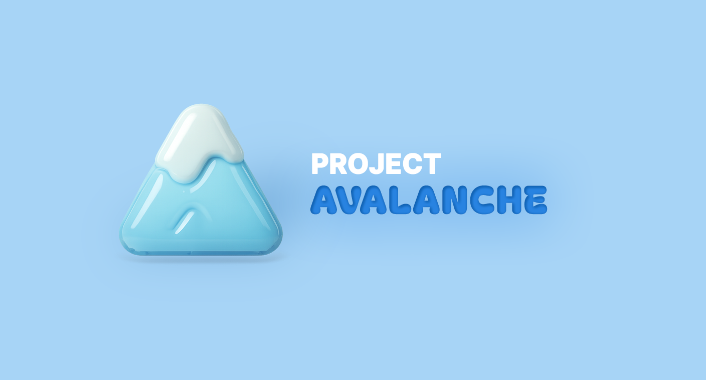

# ✨About Me

    

    
    

    

        

            <h2>이 소 연 Lee soyeon</h2>
        

        

                wxy890@gmail.com 
                010-6744-6992
        

        

            

            
 

            

                    
                    ↓ 이력서 PDF 열기 
            

        

    

* 백엔드 / 프론트엔드 / DB 설계 / 배포 경험이 있습니다.
* 코드의 가독성과 명확한 네이밍에 많은 노력을 기울입니다.
* 빠르고 효율적으로 데이터를 얻기 위한 아키텍처를 구상하는 것에 흥미를 느낍니다.
* 사용자(또는 동료) 친화적인 결과물을 도출하기 위한 고민을 합니다.

---

## ▪️ Introduce

<h3>기술적 스킬과 프로젝트 경험</h3>

 Cherry Weather  - 네이버 데브옵스 부트캠프 / 2024.02

* 날씨를 기반으로 한 커뮤니티와 AI 복장 추천을 결합한 서비스를 개발했습니다. 팀장으로서 프론트엔드와 백엔드를 모두 담당하며 풀스택 개발 경험을 쌓았습니다.
  
* 클럽, 멤버십, 좋아요, 피드 기능의 백엔드 개발을 담당했습니다. 특히 서비스 간 순환 의존성 문제를 해결하기 위해 이벤트 리스너를 활용한 느슨한 결합 구조를 구현했고, Specification API를 활용한 동적 쿼리로 복잡한 검색 기능을 구현했습니다. 이 프로젝트를 통해 전체 시스템 설계 능력과 팀 협업 경험을 쌓을 수 있었고, 더 깊이 있는 백엔드 기술을 학습하고 싶다는 동기를 얻게 되었습니다.

 Project Avalanche 선착순 구매 시스템   - 항해99 취업리부트 / 2024.09

* MSA와 대용량 트래픽 처리를 학습하며, 선착순 구매 시스템을 주제로 선택해 진행한 프로젝트입니다. 단순한 CRUD를 넘어서 실제 서비스에 서 마주할 수 있는 복잡한 문제들을 직접 경험해보고 싶었습니다. 
* 가장 큰 도전은 여러 사용자가 동시에 같은 상품을 구매할 때 재고 오버셀링 을 방지하는 것이었습니다. Redis 분산락(Redisson)을 도입해 동시성 문제를 해결했고, 실제로 분산락이 작동하는 것을 확인할 수 있었습니다. 또한 마이크로서비스 간 데이터 일관성 유지라는 새로운 난제를 만났습니다. 주문이 실패 했을 때 포인트 차감과 재고 예약을 모두 되돌려야 하는데, 서로 다른 서비스에 데이터가 분산되어 있어 기존 트랜잭션으로는 해결할 수 없었습 니다. Saga Pattern을 구현해 보상 트랜잭션을 통해 이 문제를 해결했습니다.

 

<h3>적합성 및 학습의지</h3>

효율적인 소통의 철학

* 모든 일의 결과물은 동료나 사용자가 가치를 매긴다고 생각합니다. 따라서 소통이란 내용을 상대방이 잘 이해하도록 돕는 과정이라고 여기고 "왜 전달 해야하는지"와 "어떻게 하면 잘 전달할 수 있을지"를 항상 고민합니다. 이전 직장에서는 이러한 고민을 바탕으로 업무를 공유화하여 불필요한 소통을 줄이고, 반복 업무를 자동화하여 중요한 업무를 효율적 으로 처리할 시간을 확보했습니다.

* 다양한 직무 경험을 바탕으로 코딩 과정에서도 다른 사람들이 쉽게 이해하고 유지보수할 수 있도록 코드 컨벤션을 준수하고, 일관된 코드 스타일을 유지하며, 모듈화를 통해 코드의 재사용성을 높이는 데 중점을 두었습니다. 이러한 제 노력은 코드 품질을 높여 팀 협업을 효과적으로 만들었습니다.

새로운 기술을 향한 끝없는 열정

* 저는 효율성과 트렌드를 중시하며, 새로운 기술 학습을 즐깁니다. 세미 프로젝트에서는 팀장이 제안한 최신 방식을 단기간에 학습하여 파이널 프로젝트에서 효과적으로 활용할 수 있었고, 이로 인해 코드의 가독성과 수정 용이성이 향상되었습니다. 이 경험은 더 나은 사용자 경험과 효율적 시스템 구현을 가능하게 했고, 저의 학습 의지를 강화시켰습니다.

끊임없이 성장하는 개발자의 길

* 문제 해결의 원리를 이해하려고 노력하며 동시에, 기존의 방식에 얽매이지 않고 최신 기술들을 효과적으로 활용하는 방법을 끊임없이 고민합니다. 왜, 어떻게 해결해야 하는지를 깊이 탐구하며, 효율적으로 처리할 수 있는 방법을 찾아내는 데 주력합니다. 이러한 접근 방식은 제가 개발자로서 적합하다는 것을 잘 보여줍니다. 앞으로 제 열정과 철학이 어떻게 결실을 맺을지 기대하고 있습니다.

 

<h3>팀워크와 커뮤니케이션</h3>

소통으로 만들어가는 리더십

* 팀장이 조기 취업으로 팀을 떠난 후, 제가 파이널 프로젝트의 팀장을 맡게 되었습니다. 저는 팀원들과의 소통 방식을 기존의 하향식 의사결정 구조 에서 벗어나 모든 팀원이 의견을 자유롭게 제시하고 토론할 수 있는 환경을 조성했습니다. 

* 특히 세미 프로젝트에서 프론트엔드를 담당했지만 백엔드를 지망했던 팀원들에게 이번에는 원하는 파트를 선택할 기회를 제공했습니다. 각자의 강점과 관심사를 고려한 업무 분배를 통해 팀원들의 동기부여를 높이고, 진행이 지연되는 부분에 대해서는 함께 해결 방안을 모색하며 프로젝트의 원활한 진행을 이끌어냈습니다.

효율적인 대화를 통한 이해와 협력

* 프로젝트 경험을 통해 하향식과 수평식 커뮤니케이션의 장단점을 깊이 이해하게 되었습니다. 하향식은 배울 점이 많을 때 매우 효과적이지만, 갑작스러운 기술을 이해하라는 요구는 팀원들에게 긴장과 초조함을 안겨주고 시간도 부족하게 만들었습니다. 반면, 비전공자들로 이루어진 팀 내에서 수평식 의사소통을 하며 기술 결정을 할 때는 모든 팀원이 동등한 의견을 제시할 기회를 가졌지만, 그 결정이 항상 효율적인 방법인지는 확신할 수 없었습니다.

* 이러한 경험은 저에게 다양한 소통 방식의 중요성을 체감하게 했습니다. 그리고 의사결정 과정에서 매 결정에 스스로 확신을 가질 수 있는 단단한 개발자가 되고 싶다는 목표를 갖게 되었습니다. 앞으로도 이러한 깨달음을 바탕으로 팀의 시너지를 극대화하는 데 기여하는 팀원이 되고자 합니다.

  

---

## ▪️ DevCourse

`네이버 × 비트캠프`에서 주관하는 [웹 개발자 교육🌐](/devl)을 수료하였으며, 현재 비트캠프 `AWS 프로젝트 코스`를 진행중입니다. 동시에 `항해99 취업 리부트` 코스를 진행하며 계속 개발 공부를
하였습니다.

 

<table>
  <tr>
    <th style="text-align: center; vertical-align: middle;">Program</th>
    <th style="text-align: center;">Content</th>
    <th style="text-align: center; vertical-align: middle;">Status</th>
  </tr>
  <tr>
    <td style="text-align: center; vertical-align: middle;">
      <b>항해99 취업리부트</b> 24.07 ~ 24.10 (10주)
    </td>
    <td style="text-align: left;">
     - 자료구조 & 알고리즘 
     - 대기업 시나리오 프로젝트  
    </td>
  </tr>
  <tr>
    <td style="text-align: center; vertical-align: middle;">
      <b>AWS 데브옵스 웹개발</b> 24.06 ~ 24.07 (4주)
    </td>
    <td style="text-align: left;">
     - 도커 컴포즈를 활용하여 AWS 배포 
     - EUREKA SEVER 아키텍쳐와 SOLID 이론  
     - 자율 프로젝트 
    </td>
  </tr>
  <tr>
    <td style="text-align: center; vertical-align: middle;">
      <b>네이버 데브옵스 웹개발</b> 23.08 ~ 24.03 (약 6개월)
    </td>
    <td style="text-align: left;">
     - 웹 어플리케이션 개발 팀 프로젝트 
     - 개발자를 위한 DevOps 
     - NCP DB & 스토리지 
     - 도커 컨테이너 애플리케이션 배포 
     - 운영자를 위한 DevOps
    </td>
  </tr>
</table>

---

## ▪️ Skills

 


Back-end & Ops


|  |                                                                                                                                                                                                                    |
|------|--------------------------------------------------------------------------------------------------------------------------------------------------------------------------------------------------------------------|
| 언어 | <i class="devicon-java-plain">Java</i>                                                                                                                                                                             |
| 프레임워크 | <i class="devicon-spring-original">Spring Boot</i>, <i class="devicon-spring-original">Spring MVC</i>, <i class="devicon-spring-original">Spring Security</i>, <i class="devicon-spring-original">Spring Cloud</i> |
| ORM | JPA, MyBatis, QueryDSL                                                                                                                                                                                             |
| 인증/보안 | JWT, <i class="devicon-oauth-plain">OAuth2</i>                                                                                                                                                                     |
| 데이터베이스 | <i class="devicon-postgresql-plain">PostgreSQL</i>, <i class="devicon-mysql-original">MySQL</i>, <i class="devicon-redis-plain">Redis</i>                                                                          |
| 메시징 | <i class="devicon-apachekafka-original">Apache Kafka</i>                                                                                                                                                           |
| 아키텍처 | MSA, API Gateway                                                                                                                                                                                                   |
| 문서화 | <i class="devicon-swagger-plain">Swagger</i>, <i class="devicon-openapi-plain">OpenAPI</i>                                                                                                                         |
| 테스트 | JUnit, SLF4J                                                                                                                                                                                                       |

 


Front-end


|  |                                                                                                         |
|------|---------------------------------------------------------------------------------------------------------|
| 언어 | <i class="devicon-javascript-plain">JavaScript</i>,  <i class="devicon-typescript-plain">TypeScript</i> |
| 프레임워크/라이브러리 | <i class="devicon-react-original">React</i>                                                             |
| 상태관리 | Recoil                                                                                                  |
| 스타일링 | <i class="devicon-tailwindcss-original">TailwindCSS</i>, <i class="devicon-css3-plain">CSS3</i>         |
| HTTP 클라이언트 | <i class="devicon-axios-plain">Axios</i>                                                                |


DevOps & Infrastructure


|  |  |
|------|----------|
| 빌드도구 | <i class="devicon-gradle-original">Gradle</i> |
| 버전관리 | <i class="devicon-git-plain">Git</i>, <i class="devicon-github-original">GitHub</i> |
| 컨테이너 | <i class="devicon-docker-plain">Docker</i>, <i class="devicon-docker-plain">Docker Compose</i> |
| CI/CD | <i class="devicon-jenkins-line">Jenkins</i> |
| 클라우드 | <i class="devicon-amazonwebservices-plain-wordmark">AWS</i> |
| 개발도구 | <i class="devicon-intellij-plain">IntelliJ IDEA</i>, <i class="devicon-vscode-plain">VS Code</i> |
| API 테스트 | <i class="devicon-postman-plain">Postman</i> |

 

>  Certifications 

* **정보처리기사** (필기) - 2024.07

* **SQLD** (SQRD 자격) - 2023.11

 

---

# ✨Project

## ▪ [Project Avalanche](/about/pa/)


MSA기반 대용량 주문을 다룬 프로젝트입니다. 
[️[→ 프로젝트 상세 보기]](/about/pa)


---

## ▪ [Cherry Weather](/about/cw/)


체리웨더는 날씨를 기반 커뮤니티 추천 + AI를 이용한 복장 추천 서비스입니다. 
[️[→ 프로젝트 상세 보기]](/about/cw)


 

---

## ▪ [웨얼 이즈 마이 보험 매니절?!](/about/insur/)


보험 성향 발견 게임 - 5라운드 카드 선택으로 나만의 보험 스타일을 찾기 
[️[→ 프로젝트 상세 보기]](/about/insur)


 

