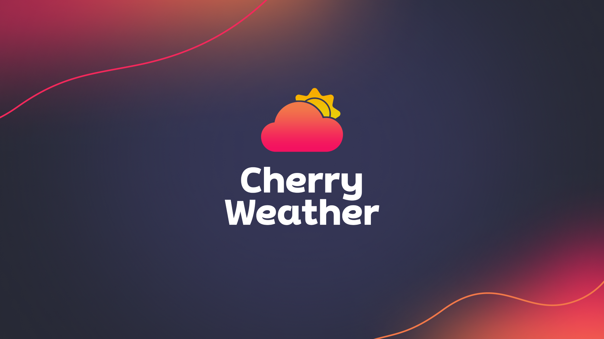

# ✨About Me

    

    
    

    

        

            <h2>이 소 연 Lee soyeon</h2>
        

        

                wxy890@gmail.com 
                010-6744-6992
        

        

            

            
 

            

                    
                    ↓ 이력서 다운받기 
            

        

    

* 백엔드 / 프론트엔드 / DB설계 / 배포 경험이 있습니다.
* 코드의 가독성과 명확한 네이밍에 많은 노력을 기울입니다.
* 빠르고 효율적으로 데이터를 얻기 위한 아키텍쳐를 구상하는 것에 흥미를 느낍니다.
* 사용자(또는 동료) 친화적인 결과물을 도출하기 위한 고민을 합니다.

---

## ▪️ Introduce

<h3>기술적 스킬과 프로젝트 경험</h3>

2023년 8월부터 6개월간 네이버 데브옵스 개발 과정에 참여하여 개발 과정을 공부하였고, 세미와 파이널 두 번의 프로젝트를 진행하였습니다.

세미 프로젝트 - market Cherry

* '마켓컬리'를 모티브로 한 소셜커머스 사이트를 제작하였고, 그중 주문/결제 Back-end 파트 담당했습니다. 주요 기술은 Spring boot, MySQL, MyBatis, Toss Payments API를 이용하여 장바구니부터 주문 완료까지의 결제 시스템을 구축하였습니다.

 파이널 프로젝트 - Cherry Weather

* 체리웨더는 날씨와 관련된 커뮤니티를 추천해 주고, 채팅 방식으로 AI 복장을 추천해 주는 복합 서비스 웹앱입니다. 프로젝트 내에서 클럽(모임), 멤버십, 좋아요, 피드, 검색 기능을 담당하였습니다. 주요 기술은 Back-end는 Spring Boot / JPA, Front-end는 React / Recoil을 사용하였습니다.

개발 외로는 프로젝트를 소개하는 ppt와 시연 영상을 제작하였습니다.

 

<h3>팀워크와 커뮤니케이션</h3>

함께 더 나은 선택을 찾아서

* 처음에는 JPA를 사용하고 싶었지만, 세미 프로젝트에서 MyBatis 사용이 제안되었을 때, 팀원들의 학습 욕구와 프로젝트의 전반적인 목표를 고려해 MyBatis가 더 적합하다는 다수 의견에 동의했습니다. 일부 팀원들이 MyBatis 사용에 계속 반대했으나, 저는 파이널 프로젝트에서 JPA를 사용하기로 이미 협의된 상황을 설명하며 서로의 입장을 정리해 설득했습니다. 그 결과, 팀원들은 MyBatis 사용에 동의하게 되었고, 다음 단계로 나아갈 수 있었습니다.

소통으로 만들어가는 리더십

* 프로젝트 중반에 팀장이 조기 취업으로 팀을 떠나면서 제가 파이널 프로젝트의 팀장을 맡게 되었습니다. 이 과정에서 저는 팀원들과의 소통 방식을 개선하는 데 주력했습니다. 기존의 하향식 의사결정 구조에서 벗어나, 모든 팀원이 의견을 자유롭게 제시하고 토론할 수 있는 환경을 조성했습니다. 진행이 지연되는 부분에 대해서는 팀원들과 함께 해결 방안을 모색하고, 필요에 따라 업무를 재분배하는 등 유연한 대처를 통해 프로젝트의 원활한 진행을 이끌어냈습니다.

배려하며 강점을 살려 함께 성장하기

* 파이널 프로젝트에서는 세미 프로젝트의 경험을 바탕으로 팀원 각자의 강점과 관심사를 고려한 업무 분배에 중점을 두었습니다. 세미 프로젝트에서 프론트엔드를 담당했던 팀원들은 사실 백엔드를 지망했으나, 팀 내 역할 배정 과정에서 프론트엔드를 맡게 되었습니다. 저는 이 팀원들에게 이번 파이널 프로젝트에서는 원하는 파트를 선택할 기회를 제공하자고 제안했습니다. 또한, 희망사항과 역량을 균형 있게 고려하여 팀원들의 동기부여를 높이고, 각자가 최선의 성과를 낼 수 있는 환경을 조성하는 데 기여했습니다.

효율적인 대화를 통한 이해와 협력

* 이런 다양한 프로젝트 경험을 통해 하향식과 수평식 커뮤니케이션의 장단점을 깊이 이해하게 되었습니다. 하향식은 배울 점이 많을 때 매우 효과적이지만, 갑작스런 기술을 이해하라는 요구는 팀원들에게 긴장과 초조함를 안겨주고 시간도 부족하게 만들었습니다. 반면, 비전공자들로 이루어진 팀 내에서 수평식 의사소통을 하며 기술 결정을 할 때는 모든 팀원이 평등하고 동등한 의견을 제시할 기회를 가졌지만, 그 결정이 항상 효율적인지는 확신할 수 없었습니다.

이 경험을 통해 다양한 소통 방식의 중요성을 체감했습니다. 의사결정 과정에서 매 결정에 스스로 확신을 가질 수 있는 단단한 개발자가 되고 싶다는 목표를 갖게 되었습니다. 앞으로도 이러한 깨달음을 바탕으로 팀의 시너지를 극대화하는 데 기여하는 팀원이 되고자 합니다.

 

<h3>적합성 및 학습의지</h3>

문제를 해결하며 성장한 시간들

* 오랜 사회 경험을 통해 다양한 문제를 스스로 해결해왔고, 이를 통해 문제 해결 능력을 꾸준히 발전시켜왔습니다. 코딩 과정에서도 직면한 도전과 어려움을 극복하면서 새로운 지식을 습득하고 실력을 향상시켜 왔습니다.

끊임없이 질문하며 나아가는 여정

* 항상 "어떻게?"와 "왜?"라는 질문을 가지고 살아갑니다. 어떤 것이 우연히 작동하게 되어도 그 이유를 탐구하고, 어떻게 사용해야 하는지, 왜 사용해야 하는지를 깊이 생각합니다. 원리를 충분히 이해하면서도 전통적인 접근 방식을 넘어서서 이미 존재하는 기술들을 효과적으로 사용하는 방법을 끊임없이 고민합니다. 이는 제가 개발자로서 적합하다는 것을 잘 보여주는 면모라고 스스로 생각하고 있습니다.

새로운 기술을 향한 끝없는 열정

* 저는 효율성과 트렌드를 중시하며, 새로운 기술을 배우는 것을 좋아합니다. 세미 프로젝트에서는 팀장이 제안한 최신 방식을 단기간에 학습하여 파이널 프로젝트에서 효과적으로 활용할 수 있었고, 이로 인해 코드의 가독성과 수정 용이성이 향상되었습니다. 또한, 더 나은 사용자 경험과 효율적인 시스템을 구현하는 경험을 하였습니다. 이러한 경험은 저의 학습 의지를 더욱 강화시켰고, 기술 공부에 대한 끊임없는 동기부여가 되었습니다.

더욱 향상된 실력을 갖추고자 하는 강한 열정을 가지고 있습니다. 어려운 상황에서도 포기하지 않고 문제를 해결해 나가는 과정에서 제 성장을 체감하며, 이를 통해 더 나은 개발자로 성장할 수 있다고 믿습니다. 이러한 자세와 열정이 저를 이 분야에 적합한 인재로 만들어준다고 생각합니다.

---

## ▪️ DevCourse

`네이버 × 비트캠프`에서 주관하는 [웹 개발자 교육🌐](/devl)을 수료하였으며, 현재 비트캠프 `AWS 프로젝트 코스`를 진행중입니다. 동시에 `항해99 취업 리부트` 코스를 진행하며 계속 개발 공부를
하고있습니다. - 2024.07.09

 

<table>
  <tr>
    <th style="text-align: center; vertical-align: middle;">Program</th>
    <th style="text-align: center;">Content</th>
    <th style="text-align: center; vertical-align: middle;">Status</th>
  </tr>
  <tr>
    <td style="text-align: center; vertical-align: middle;">
      <b>항해99 취업리부트</b> 24.07 ~ 24.10 (10주)
    </td>
    <td style="text-align: left;">
     - 자료구조 & 알고리즘 
     - 대기업 시나리오 프로젝트  
    </td>
    <td style="text-align: center; vertical-align: middle;">진행중</td>
  </tr>
  <tr>
    <td style="text-align: center; vertical-align: middle;">
      <b>AWS 데브옵스 웹개발</b> 24.06 ~ 24.07 (4주)
    </td>
    <td style="text-align: left;">
     - 도커 컴포즈를 활용하여 AWS 배포 
     - EUREKA SEVER 아키텍쳐와 SOLID 이론  
     - 자율 프로젝트 
    </td>
    <td style="text-align: center; vertical-align: middle;">`수료` </td>
  </tr>
  <tr>
    <td style="text-align: center; vertical-align: middle;">
      <b>네이버 데브옵스 웹개발</b> 23.08 ~ 24.03 (약 6개월)
    </td>
    <td style="text-align: left;">
     - 웹 어플리케이션 개발 팀 프로젝트 
     - 개발자를 위한 DevOps 
     - NCP DB & 스토리지 
     - 도커 컨테이너 애플리케이션 배포 
     - 운영자를 위한 DevOps
    </td>
    <td style="text-align: center; vertical-align: middle;">`수료` </td>
  </tr>
</table>

---

## ▪ Skills

 


Back-end & Ops


|                                                               |                                                                                                                                                                                       |
|:--------------------------------------------------------------|:--------------------------------------------------------------------------------------------------------------------------------------------------------------------------------------|
| <i class="devicon-java-plain"></i> JAVA                       | OOP, 스트림API,컬렉션 프레임워크(List, Map), 불변성 유지(record, Builder패턴)                                                                                                                        |
| <i class="devicon-spring-original"></i> Spring Boot           | 애플리케이션 개발                                                                                                                                                                             |
| <i class="devicon-spring-original"></i> Spring MVC            | 웹 애플리케이션 개발                                                                                                                                                                           |
| <i class="devicon-hibernate-plain"></i> JPA / MyBatis         | 데이터베이스 연동, CRUD 작업, 엔티티 매핑                                                                                                                                                            |
| <i class="devicon-spring-original"></i> Spring Security & JWT | 인증 및 권한부여                                                                                                                                                                             |
| 데이터베이스                                                        | <i class="devicon-mysql-original"></i> MySQL　<i class="devicon-redis-plain"></i> Redis                                                                                               |
| 도구 및 환경                                                       | <i class="devicon-gradle-original"></i> Gradle　<i class="devicon-maven-plain"></i> Maven　<i class="devicon-docker-plain"></i> Docker　<i class="devicon-github-original"></i> GitHub |
| 테스트 및 품질관리                                                    | <i class="devicon-junit-plain"></i> JUnit, Slf4j                                                                                                                                      |

 


Front-end


|   |                                                                                                                                                                 |
|:------------|:----------------------------------------------------------------------------------------------------------------------------------------------------------------|
| 언어          | <i class="devicon-javascript-plain"></i> JavaScript 　 <i class="devicon-typescript-plain"></i> TypeScript                                                       |
| 마크업& 스타일 시트 | <i class="devicon-html5-plain"></i> HTML5　<i class="devicon-css3-plain"></i> CSS3                                                                               |
| 프레임워크       | <i class="devicon-react-original"></i> React                                                                                                                    |
| 상태 관리       | Recoil          |
| 도구 및 환경     | <i class="devicon-npm-original-wordmark"></i> npm　 <i class="devicon-yarn-original"></i> yarn                                                                   |

 


Tools


<i class="devicon-intellij-plain"></i> Intelli J 　 <i class="devicon-trello-plain"></i> Trello 　 <i class="devicon-slack-plain"></i> Slack 　 <i class="devicon-figma-plain"></i> Figma 　 <i class="devicon-jira-plain"></i> Jira 　 <i class="devicon-confluence-plain"></i> Confluence

 

>  Certifications 

* **정보처리기사** (필기) - 2024.07

* **SQLD** (SQRD 자격) - 2023.11

 

---

# ✨Project

## ▪ [Cherry Weather](/about/cw/)


체리웨더는 날씨를 기반 커뮤니티 추천 + AI를 이용한 복장 추천 서비스입니다. 
[️[→ 프로젝트 상세 보기]](/about/cw)


 

