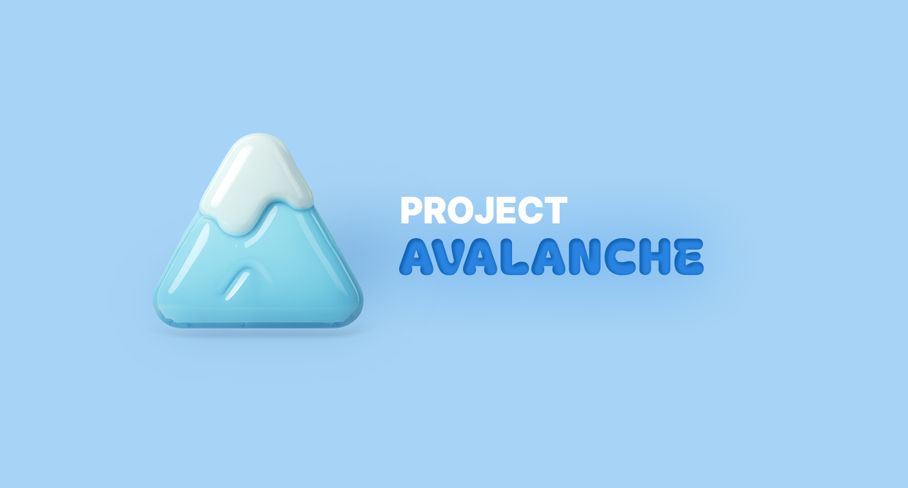

> **포인트 기반 선착순 구매 시스템**  
> 대용량 트래픽과 동시성 문제 해결에 중점을 둔 **MSA 기반** 포트폴리오 프로젝트


# ✨ 프로젝트 개요

| 항목 | 내용 |
|------|------|
| 프로젝트명 | Project Avalanche |
| 핵심 기능 | 선착순 구매, 동시성 제어, 분산 트랜잭션 |
| 주요 기술 | Spring Boot, Redis, Kafka, Docker, Saga |
| MSA 서비스 수 | 6개 (Auth, User, Order, Product, Point, Shipping) |


## ▪ 핵심 목표
- **MSA(Microservices Architecture)** 기반의 확장 가능한 시스템 설계
- **대용량 트래픽** 환경에서의 동시성 제어 및 성능 최적화
- **Redis**를 활용한 캐싱 전략으로 **선착순 구매** 기능 구현
- **분산 트랜잭션** 처리를 위한 Saga 패턴 적용

## ▪ 핵심 기능
- **실시간 재고 관리**: Redis 분산 락을 통한 동시성 제어
- **분산 트랜잭션**: Saga 패턴을 통한 안전한 주문 처리
- **API Gateway**: 모든 요청의 중앙 집중 라우팅
- **재고 예약 시스템**: 결제 진행 중 재고 임시 점유로 동시 구매 방지
- **멀티 디바이스 관리**: 클라이언트 ID 기반 개별/전체 기기 로그아웃 기능
- **이메일 인증**: SMTP 기반 30분 만료 토큰으로 회원가입 검증
- **배치 동기화**: Redis 예약 재고를 30초 간격으로 PostgreSQL 메인 DB에 반영

## ▪ 기술적 도전 과제
- **동시성 문제**: Redis 분산 락으로 Race Condition 방지
- **데이터 일관성**: Saga 패턴을 통한 분산 트랜잭션 처리
- **성능 최적화**: Redis 캐싱으로 DB 부하 감소
- **장애 복구**: 실패 시 자동 보상 트랜잭션 구현

## ▪ 기술 스택


||                                                                             |
|:--|:----------------------------------------------------------------------------|
|Backend| `Java 21``Spring Boot 3.2.2` `Spring Security` `Spring Cloud` `Gradle``JWT` |
|Database & Cache| `PostgreSQL``Redis` `Redisson`|
|Message Queue| `Apache Kafka`|
|Service Discover| `Eureka`|
|DevOps & Infrastructure| `Docker` `Docker Compose`|


<br/>


# ✨ 시스템 설계 

## ▪ ERD


---


## ▪ MSA 



graph TB
%% Client Layer
subgraph ClientLayer["Client Layer"]
Client["클라이언트"]
end

    %% Configuration Layer
    subgraph ConfigLayer["Configuration Layer"]
        ConfigServer["Config Server"]
        MicroServices["Micro Services"]
        ConfigServer --> MicroServices
    end
    
    %% API Gateway Layer
    subgraph GatewayLayer["API Gateway Layer"]
        APIGateway["API Gateway"]
    end
    
    %% Microservices Layer
    subgraph MicroservicesLayer["Microservices Layer"]
        OrderService["Order Service<br/>주문 관리"]
        ShippingService["Shipping Service<br/>배송 관리"]
        PointService["Point Service<br/>포인트 관리"]
        ProductService["Product Service<br/>상품 관리"]
        UserService["User Service<br/>사용자 관리"]
        AuthService["Auth Service<br/>인증 및 보안"]
    end
    
    %% Messaging Layer
    subgraph MessagingLayer["Messaging Layer"]
        Kafka["Kafka<br/>비동기 메시징"]
    end
    
    %% Data Layer
    subgraph DataLayer["Data Layer"]
        PostgreSQL["PostgreSQL<br/>메인 데이터베이스"]
        Redis["Redis<br/>캐시 & 세션"]
    end
    
    %% Client connections
    Client --> APIGateway
    
    %% API Gateway connections
    APIGateway --> OrderService
    APIGateway --> ShippingService
    APIGateway --> PointService
    APIGateway --> ProductService
    APIGateway --> UserService
    APIGateway --> AuthService
    
    %% Saga Pattern connections (dotted lines)
    OrderService -.->|Saga Pattern| ShippingService
    OrderService -.->|Saga Pattern| PointService
    OrderService -.->|Saga Pattern| ProductService
    OrderService -.->|Saga Pattern| Kafka
    
    %% Kafka connections
    Kafka -.-> ShippingService
    Kafka -.-> PointService
    Kafka -.-> ProductService
    
    %% Database connections
    OrderService --> PostgreSQL
    ShippingService --> PostgreSQL
    PointService --> PostgreSQL
    ProductService --> PostgreSQL
    UserService --> PostgreSQL
    AuthService --> PostgreSQL
    
    %% Redis connections
    OrderService --> Redis
    ProductService --> Redis
    AuthService --> Redis
    APIGateway --> Redis




<br><br>


서비스 구성


| 서비스 | 주요 책임 | 핵심 기술                                      |
|--------|-----------|--------------------------------------------|
| **Auth Service** | 인증/인가, JWT 토큰 관리 | Spring Security, Redis                     |
| **User Service** | 사용자 관리, 프로필 | JPA, PostgreSQL                            |
| **Order Service** | 주문 처리, Saga 오케스트레이션 | Kafka, Redisson                            |
| **Product Service** | 상품/재고 관리, 동시성 제어 |  Redis 분산락, QueryDSL, Kafka, 보상 트랜잭션 |
| **Point Service** | 포인트 차감 | Kafka, 보상 트랜잭션                             |
| **Shipping Service** | 배송 관리 | Kafka, 보상 트랜잭션                             |

<br/>

---

# ✨ 백엔드 구현 기능

|  |   |
|--------|-----------|
| **MSA** | • Eureka를 이용한 서비스 디스커버리 구현<br>• DDD(Domain-Driven Design) 기반의 패키지 구조 설계 |
| **Auth Service**<br>인증 및 보안 | • JWT를 이용한 로그인 및 액세스 토큰 발급<br>• 회원가입 시 회원 인증을 위한 토큰 이메일로 발송<br>(Thymeleaf를 사용한 이메일 템플릿 제작)<br>• 리프레시 토큰 발급 및 관리<br>• 로그아웃 기능 (토일 기기 및 모든 기기)<br>• Redis를 활용한 토큰 저장 및 관리 |
| **API Gateway** | • Redis 서버를 통한 사용자 토큰 검증<br>• 검증된 사용자 정보를 UserContext로 로컬 전달 |
| **Config Service**<br>설정 관리 | • API Gateway 라우팅 설정<br>• 마이크로서비스별 주요 설정 정보 중앙화<br>• 공통 설정 관리 (Redis, PostgreSQL, Redisson, Kafka, JWT 등) |
| **User Service**<br>사용자 관리 | • 회원가입 프로세스 구현<br>• 사용자 정보 양방향 암호화<br>• 비밀번호 단방향 암호화<br>• 비밀번호 재발급 기능<br>• 사용자 정보 조회 API |
| **Order Service**<br>주문 관리 | • Saga 패턴과 Kafka를 활용한 비동기 주문 생성 프로세스<br>• Redisson을 이용한 분산 락 구현으로 동시성 제어<br>• 주문 진행 중 오류 발생 시 보상 트랜잭션 처리<br>• QueryDSL과 페이징을 활용한 주문 내역 조회 기능 |
| **Product Service**<br>상품 관리 | • ProductService: 상품 CRUD 담당<br>• InventoryService: 선착순 구매 재고 관리<br>• Redis를 활용한 빠른 재고 접근<br>• 분산 락을 통한 안정적인 재고 차감<br>• 보상 트랜잭션 구현<br>• 주문 진행 중 예외 재고 관리<br>• 스케줄러를 통한 PostgreSQL 서버 재고 동기화 |
| **Point Service**<br>포인트 관리 | • Kafka를 통한 비동기 포인트 차감<br>• 포인트 관련 보상 트랜잭션 구현 |
| **Shipping Service**<br>배송 관리 | • Kafka를 통한 비동기 배송지 등록<br>• 배송 관련 보상 트랜잭션 구현 |
| **테스트 및 개발 지원** | • 대용량 주문 처리를 위한 JUnit 기반 통합 테스트 환경 구성<br>• Kafka 메시징에 Avro 스키마 사용으로 데이터 직렬화 효율성 향상 |
---

# ✨ 분산 트랜잭션 처리


## ▪  선착순 구매 프로세스

1. **상품 조회**: Redis 캐시에서 실시간 재고 확인
2. **구매 시도**: 분산 락 획득 후 예약 재고 차감
3. **확률 계산**: 상품별 등급에 따른 당첨 확률 적용
4. **결제 처리**: Saga 패턴으로 포인트 차감 및 주문 생성
5. **재고 확정**: 성공 시 실제 재고 차감, 실패 시 예약 재고 복원

## ▪ 정상 플로우


sequenceDiagram
participant Client
participant OrderService as Order Service
participant ProductService as Product Service
participant PointService as Point Service
participant ShippingService as Shipping Service

    %% 정상 처리 플로우
    note over Client, ShippingService: [정상 처리]
    Client->>OrderService: 주문 요청
    
    par 병렬 처리
        OrderService->>ProductService: 재고 확인 요청
    and
        OrderService->>PointService: 포인트 차감 요청
    and
        OrderService->>ShippingService: 배송 준비 요청
    end

    %% 보상 트랜잭션 플로우
    note over Client, ShippingService: [응답 수집]
    
    par 응답 처리
        ProductService-->>OrderService: 재고 예약 완료
    and
        PointService-->>OrderService: 포인트 차감 완료
    and
        ShippingService-->>OrderService: 배송 준비 완료
    end

    %% 성공 응답
    note over Client, ShippingService: 모든 단계 성공 확인
    OrderService->>Client: 주문 완료 응답



## ▪ 보상 트랜잭션


sequenceDiagram
participant Client
participant OrderService as Order Service
participant ProductService as Product Service
participant PointService as Point Service
participant ShippingService as Shipping Service

    %% 주문 요청
    Client->>OrderService: 주문 요청
    
    %% 병렬 처리
    note over OrderService, ShippingService: [병렬 처리]
    par 병렬 처리
        OrderService->>ProductService: 재고 확인 요청
    and
        OrderService->>PointService: 포인트 차감 요청
    and
        OrderService->>ShippingService: 배송 준비 요청
    end

    %% 응답 수집 (실패 포함)
    note over OrderService, ShippingService: [응답 수집]
    par 응답 처리
        ProductService-->>OrderService: 재고 예약 완료 ✅
    and
        PointService-->>OrderService: 포인트 부족 실패 ❌
    and
        ShippingService-->>OrderService: 배송 준비 완료 ✅
    end

    %% 실패 감지 - 보상 시작
    note over OrderService, ShippingService: 실패 감지 - 보상 시작

    %% 보상 트랜잭션
    note over OrderService, ShippingService: [보상 트랜잭션]
    par 보상 처리
        OrderService->>ProductService: 재고 복구 요청
    and
        OrderService->>ShippingService: 배송 취소 요청
    end

    %% 보상 완료
    note over OrderService, ShippingService: [보상 완료]
    par 보상 응답
        ProductService-->>OrderService: 재고 복구 완료
    and
        ShippingService-->>OrderService: 배송 취소 완료
    end

    %% 클라이언트에 주문 취소 응답
    OrderService->>Client: 주문 취소


<br>


#### 주문 실패 시나리오 예시

```json
{
  "status": "CANCELLED",           // 4. 주문 취소 처리
  "commandStatuses": {
    "CHECK_STOCK": "SUCCESS",      // 1. 예약 재고 차감 성공
    "APPLY_POINTS": "FAILED",      // 2. 포인트 차감 실패
    "PREPARE_SHIPPING": "SUCCESS"  // 1. 주소지 등록 성공
  },
  "compensationStatuses": {
    "CHECK_STOCK": "SUCCESS",      // 3. 재고 복원 완료
    "PREPARE_SHIPPING": "SUCCESS"  // 3. 배송 준비 취소 완료
  }
}
```

---

# ✨ 트러블 슈팅

* [포인트/재고 차감 실패 시 보상 트랜잭션 멱등성 처리](/posts/avalanche_006/)
* [MSA 전환 시 UserContext 관리 설계](/posts/avalanche_007/)

---

# ✨ 해결한 기술적 문제들

<span class="font-emphasis-underline">분산 트랜잭션</span>
- **문제** - MSA 환경에서 여러 서비스에 걸친 데이터 일관성
- **해결** - Choreography 방식의 Saga 패턴 적용
- **결과** - 서비스 실패 시 자동 보상 트랜잭션으로 일관성 보장

<span class="font-emphasis-underline">동시성 제어</span>
- **문제** - 동일 상품에 대한 동시 주문 요청 시 재고 부정확성
- **해결** - Redisson 분산 락으로 원자적 재고 처리
- **결과** - Race Condition 방지 및 정확한 재고 관리

<span class="font-emphasis-underline">성능 최적화</span>
- **캐싱 전략** - Redis를 통한 상품/재고 정보 캐싱
- **비동기 처리** - CompletableFuture를 활용한 논블로킹 주문 처리
- **폴링 최적화** - 1초 간격으로 최대 30초간 주문 상태 확인

