* 프레임워크로 작업이 완료되면 라이브러리 - 프레임워크에서 라이브러리 사용 - 무한반복
* 라이브러리 모인 곳  - 깃 허브
* 프론트는 vercel에 올려서 도메인처리하는 방법을 알아야 함

* Gradle
  * 설치하면 라이브러리가 생김
  * 기계어로 전환시켜주는 역할


* 객체 
  * 클래스와 인스턴스의 차이점 = 상태가 다르다.
    * 클래스 : 개발자가 인지하기 위한 객체
    * 인스턴스 : 기계가 인지하기 위한 객체

* 디스크에서 메모리로 상태를 변환하는 것(올리는 것) : loading
* 메모리에서 디스크로 상태를 변환하는 것 : save

* 추상적인 개념은 사람이 만든 것 (ex. H20)

* 객체가 여러개면 자료구조. 선형으로 등록되면 리스트 ..

---

### Docker

* 상태 종류 : 이미지와 컨테이너
  * 저장은 이미지로 실행하면 컨테이너
    * 이미지 == 클래스
    * 컨테이너 == 인스턴스
* 자바에서 클래스 -> 인스턴스로 만들 때 new로 생성
* 도커에서 이미지 -> 컨테이너로 만들 때 명령어 running

* 명령어가 확장자가 되고 확장자가 명령어가 됨.

* 객체의 차원을 올리는 것 -> 자료 구조

  
### Docker 라이브러리

* 라이브러리를 가져올 때는 이미지로 가져온다.
* 도커를 처음 가져왔을 때에는 이미지 상태.


### 컴포즈와 도커 

> 한번에 올리면 컴포즈, 하나씩 올리면 도커 -> 차원이 다름.

* 도커(1차원-물한컵) - 컴포즈(2차원-대야) - 쿠버네틱스 (3차원-바다)

* 3차원까지는 인간이 인지할 수 있음. 

* 쿠버네티스는 어렵고 도커는 쉽다? 도커를 모르기때문에 쿠버가 어려운 것.

(미니쿠베는 무거운 편.)


### vs에서 프로젝트 생성

*  'workspace' 디렉토리 생성 : 

* vs에서 스프링 프레임워크 추가

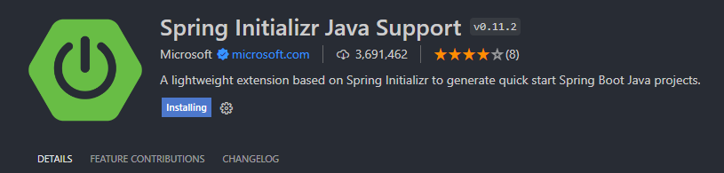

* 스프링 프로젝트 생성

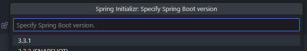

3.3.1 > java > 가비아에서 구매한 도메인 등록 > 기능 등록 > 17 > jar > 의존성 Spring web 선택 후 생성

- 기능 추가 필수 : eureka, api, user
- 기타 프로젝트 기능 : post, search 등

* 

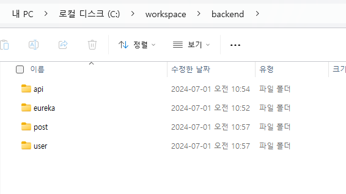


### 명령어로 도커 실행


```shell
# 도커 버전 확인
> docker --version
Docker version 24.0.7, build afdd53b

# 도커 도움말
> docker --help

Common Commands:
  run         Create and run a new container from an image 
              # create로 컨테이너 만들고 실행. 컨테이너가 있으면 그냥 실행
  exec        Execute a command in a running container # 실행
  ps          List containers  # 컨테이너를 보는 것
  build       Build an image from a Dockerfile 
  pull        Download an image from a registry # 이 이미지를 다운
  push        Upload an image to a registry
  images      List images
  login       Log in to a registry
  logout      Log out from a registry
  search      Search Docker Hub for images
  version     Show the Docker version information
  info        Display system-wide information

```

* mySql 설치

```shell
# 다운
> docker pull mysql

# 
> docker images
REPOSITORY                  TAG       IMAGE ID       CREATED         SIZE
mysql                       latest    05247af91864   12 days ago     578MB
redis                       latest    76506809a39f   6 months ago    138MB
swaggerapi/swagger-editor   latest    6a988710578c   9 months ago    65MB
testcontainers/ryuk         0.5.1     ec913eeff75a   13 months ago   12.7MB
mailhog/mailhog             latest    4de68494cd0d   3 years ago     392MB

# 실행시키기 
> docker run 05247af91864

# 실행시키면 옵션값을 지정해주지 않아 에러가 생긴다
2024-07-01 04:43:14+00:00 [Note] [Entrypoint]: Entrypoint script for MySQL Server 8.4.0-1.el9 started.
2024-07-01 04:43:16+00:00 [Note] [Entrypoint]: Switching to dedicated user 'mysql'
2024-07-01 04:43:16+00:00 [Note] [Entrypoint]: Entrypoint script for MySQL Server 8.4.0-1.el9 started.
2024-07-01 04:43:16+00:00 [ERROR] [Entrypoint]: Database is uninitialized and password option is not specified
    You need to specify one of the following as an environment variable:
    - MYSQL_ROOT_PASSWORD
    - MYSQL_ALLOW_EMPTY_PASSWORD
    - MYSQL_RANDOM_ROOT_PASSWORD
```

```shell
mysql
show tables;
use mydb

# 실행중인 컨테이너 확인
> docker ps

# 모든 컨테이너 확인
> docker ps -a

# ID로 실행중인 컨테이너 삭제(이미지는 남아있음)
> docker rm -f ID

# 이미지 파일 목록 조회
> docker images

# 이미지 ID로 파일 삭제
> docker rmi ID

# mySql 실행
> docker exec -it mydb-container bash
> mysql -u root -p
```


### EC2 

EC2 > 인스턴스 > 인스턴스 시작

인스턴스 이름 지정

젠킨스를 하려면 t2.medium 정도는 사용해야함..

키 생성해서 로컬>사용자>.ssh에 저장

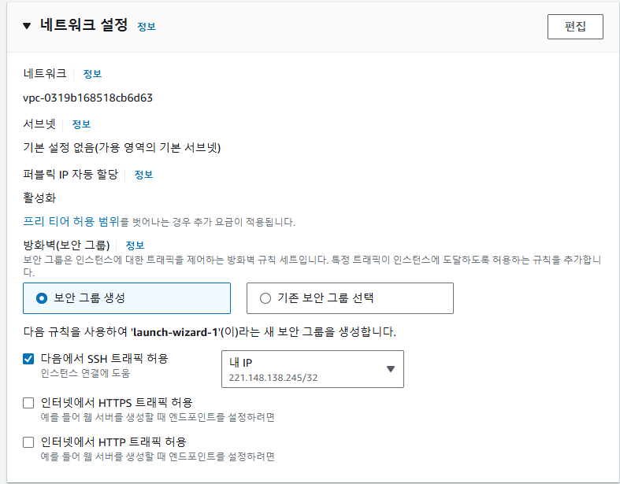

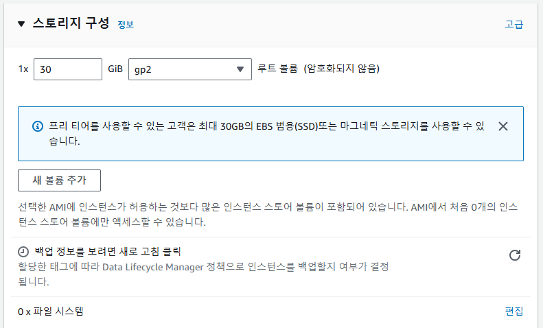

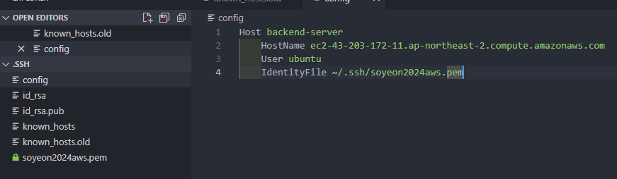

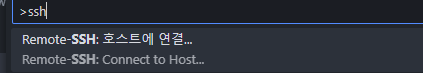

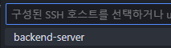

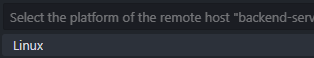

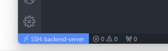

이렇게 나오면 ok.

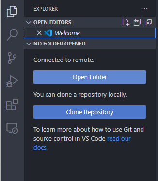

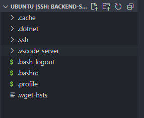

서버안 파일들 확인된다.

```shell
ubuntu@ip-172-31-2-157:~$ touch docker-compose.yml
ubuntu@ip-172-31-2-157:~$ ls
docker-compose.yml
ubuntu@ip-172-31-2-157:~$ vim docker-compose.yml 
```

편집기 열어서 아래 내용 복사 붙여넣기 후 저장 ( :wq!)

```shell
services:
  mysql:
    container_name: mydb-container
    image: mysql:latest
    volumes:
      - ./mysql/demo/etc/mysql/conf.d:/etc/mysql/conf.d:ro
      - ./mysql/demo/var/lib/mysql:/var/lib/mysql
      - ./mysql/demo/var/log/mysql:/var/log/mysql
    environment:
      - MYSQL_DATABASE=mydb
      - MYSQL_ROOT_PASSWORD=rootpass
      - MYSQL_ROOT_HOST=%
    command: ['--character-set-server=utf8mb4', '--collation-server=utf8mb4_unicode_ci']
    ports:
      - "3306:3306"
    restart: always
   
  mongodb:
    container_name: mgdb-container
    image: mongo:latest
    ports:

      - 27017:27017
    volumes:
      - ./mongodb:/data/mgdb
    environment:
      - MONGO_INITDB_ROOT_USERNAME=root
      - MONGO_INITDB_ROOT_PASSWORD=rootpass
      - MONGO_INITDB_DATABASE=mgdb
    restart: always

  redis:
    container_name: redis-container
    image: redis:latest
    ports:
      - 6379:6379
    command: redis-server --requirepass rootpass
    volumes:
      - ./redis/data:/data
      - ./redis/conf/redis.conf:/usr/local/conf/redis.conf
    labels:
      - "name=redis"
      - "mode=standalone"
    restart: always

  postgres:
    container_name: pgdb-container
    image: postgres:latest
    volumes:
      - ./postgres:/var/lib/postgresql/data
    ports:
      - "5432:5432"
    environment:
      POSTGRES_USER: root
      POSTGRES_PASSWORD: rootpass
      POSTGRES_DB: pgdb
    restart: always
```

```shell
$ sudo apt update
$ sudo apt upgrade
$ sudo apt-get update

$ sudo apt-get install snapd
$ sudo snap refresh

$ sudo snap install hello-world
$ sudo snap install docker

$ sudo addgroup --system docker
$ sudo adduser $USER docker
$ newgrp docker
$ sudo snap disable docker
$ sudo snap enable docke
```


