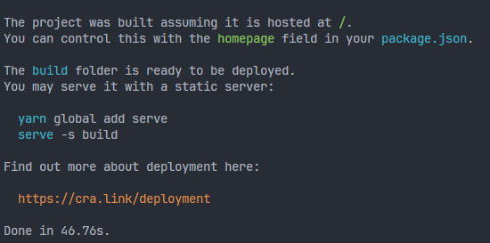

## Front 서버 올리기 

### 가비아에서 도메인 작업하기 

가장 먼저 빌드가 성공해야함.

```shell
wxy89@Gyul MINGW64 /c/project/yellowboard-FE (feature/add-css-framework)
$ yarn build
```


위와같은 메세지가 떠서 아래 종속성 추가 설치 

```shell
wxy89@Gyul MINGW64 /c/project/yellowboard-FE (feature/add-css-framework)
$ yarn add @babel/plugin-proposal-private-property-in-object --dev
```




### 가비아 DNS 설정


위 도메인에서 `설정`으로 들어가기


`레코드 수정` > `레코드 추가` 클릭

값/위치에는 vercel 값을 넣으면됩니다. https://vercel.com/


## Vercel 


`Start Deploying` - GitHub 로그인 - Vercel연동 - 


`install`


설치할 리포지토리 선택 후 `install`


`import`


 Configure Project - Root Directory - Edit - (팝업창에서 루트 디렉토리 선택 후 ) - Deploy


`Continue`

---


좌측 `Add Domain` 선택


### 첫번째 값 (value)


> value : 76.76.21.21


### 두번째 값 (value)


> value : cname.vercel-dns.com.


가비아로 돌아가서


이렇게 입력해준다. 반드시 '확인'을 눌러주고 '저장'할 것.


내가 구매한 도메인을 입력해서 들어가서 확인한다.
정상적으로 프론트엔드가 출력되면 ok.


