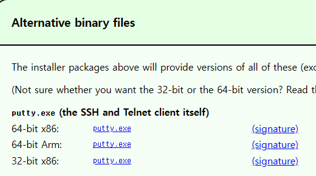
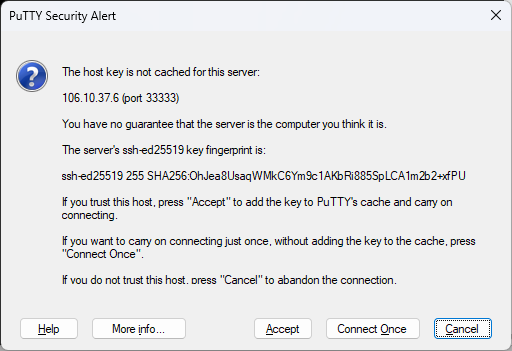
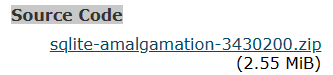
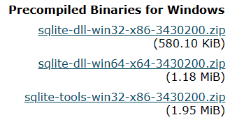

### putty.exe 설치 

* https://www.chiark.greenend.org.uk/~sgtatham/putty/latest.html



64-bit86L putty.exe 다운 (사진에서 첫번째)

* putty.exe 실행




이거 뜨면 정상


* 폰트 변경
오른쪽 클릭 > 체인지 세팅 > appearance > font d2 코딩으로 변경

* 경고 소리 끄기 
bell - none

* 현재 설정 저장
세션 - 현재 만든 세션 선택 저장.


### 명령어

* `hostname` : 컴퓨터 이름 호출
* `who -q` : 접속된 아이디들만 
* `who am i` : 내가 누구인지

* `whoami` : 내 id
* w 전체 로그인 

* echo "텍스트" : 텍스트 내용을 화면에 출력

```shell
# who의 내용을 을 정렬
$ who | sort : 정렬

# who의 내용을 을 정렬 + 각 행마다 번호붙이기
$ who | sort | n
```


### 메일 보내기

* mail : 현재 받은 메일 확인
* mail 상대방ID : 상대방ID로 메일 보내기
* mail 이메일주소 : 이메일주소로 메일보내기

```shell
$ who | sort | nl | mail -s "who" ssomal_@naver.com  
```
* who를 실행 후 정렬한 내용을 내 메일로 보내기

```shell
$ echo "오늘은 수요일" | mail -s "메일제목입니다" ssomal_@naver.com
```
* `-s` : subject 


```shell
mysql> use itDB;
Database changed
mysql> show tables;
Empty set (0.00 sec)

mysql> create table ta10(
    -> name char(20),
    -> age int);
Query OK, 0 rows affected (0.01 sec)

mysql> desc ta10;
+-------+----------+------+-----+---------+-------+
| Field | Type     | Null | Key | Default | Extra |
+-------+----------+------+-----+---------+-------+
| name  | char(20) | YES  |     | NULL    |       |
| age   | int(11)  | YES  |     | NULL    |       |
+-------+----------+------+-----+---------+-------+
2 rows in set (0.00 sec)

mysql>
```

* uptime

```shell
j10@alinux:~$ cd
j10@alinux:~$ pwd
/home/j10
j10@alinux:~$ ls
mbox  public_html
j10@alinux:~$ cat > public_html/index.html
이소연
j10@alinux:~$ nl public_html/index.html
1  이소연
```

* cat > public_html/index.html : index.html 파일 생성

* nl  public_html/index.html :  파일 읽기

* 네이버 각
  * 우리가 지금 쓰고 있는 아이디, 테이블은 네이버 '각'에 있을 수있다
  * 전쟁에 대비해 지하에 설치 돼 있음


* localhost : 리눅스의 세계로 펼쳐짐. 찾아보자..
* localhost/~아이디
* localhost/~j10 : 내가 만든 index.html이 보임
* 이 때 현재위치가 상위 디렉토리에 있어도 index.html을 찾아서 실행함.


* sqlite3 실행

```shell
sqlite> .open myEB
sqlite> .table
sqlite> create table Man(
   ...> name char(20),
   ...> age int);
sqlite> insert into Man values("이소연",20);
sqlite> insert into Man values("아이어",33);
sqlite> selet * from Man;
Error: near "selet": syntax error
sqlite> select * from Man;
이소연|20
sqlite> .mo col
sqlite> .hea on
sqlite> select * from Man;

sqlite>.import y3 Man
sqlite> select * from Man;

name        age
----------  ----------
이소연         20
이소연         44
나라미         22
쿠쿠로         24

#병합됨
```

* sqlite 다운 
  * https://sqlite.org/index.html > 
  * download 클릭 
  * 소스코드 : Source Code> sqlite-amalgamation-3430200.zip 다운
  * 
  * 프로그램 : Precompiled Binaries for Windows > sqlite-tools-win32-x86-3430200.zip
  * 

* 툴즈 : 설치 안해도 됨.
* sqlite3.exe 실행
* 방금 전에 한거랑 똑같음. sqlite 작업을 빠르게 할 때 이 툴을 사용
* 소스코드 

### DNS 서비스  

ip주소를 도메일으로 바꿔서 접속 할 수 있도록 해주는 서비스

```shell
C:\Users\wxy89>nslookup
기본 서버:  kns.kornet.net
Address:  168.126.63.1

# naver.com
서버:    kns.kornet.net  
Address:  168.126.63.1  #나한테 응답한 ip

권한 없는 응답:
이름:    naver.com
Addresses:  223.130.200.107   #여기서부터 아래 4개를 주소창에 넣으면 네이버가 나옴
          223.130.200.104
          223.130.195.95
          223.130.195.200
```


### 웹서비스

* DB넣고 뺄 수 있어야함
* 게시판에 글을 쓰면 Db에 저장돼야함. -> 웹서비스가 돌아가고 있음 

* 웹서버 / 메일서버(도멘인이 있어야함) / 데이터 베이스 서버


### 주요 오류

* 권한이 없음
  * Only root may add a user or group to the system.
  * cannot create directory ‘/aa’: Permission denied

*  파일이 없을 때
  * -bash: cd: /bb: No such file or directory :

*  명령어가 없다.
  *  command not found


### 리눅스 용어 의미

* ~: tilde, Home (집이라는 뜻)
* ~K : k네 집

* cd ~아이디 : 접근은 가능/ 생성은 안됨.
* cd ~ : 내 집으로 돌아옴
* mkdir dd : dd라틑 디렉토리 생성
* echo $HOME
* 변수 선언 : `a=50`  `b=3.5` `c='corea'`
* 변수를 쓸때는 `$` 사용
  * echo $a $b $c

* $ echo $LOGNAME
 > id 출력됨 (j10)

* $ echo $SHELL

* 네이버의 메일 용량
  * ~ssomal_ (내 계정의 집) 의 네이버의 하드디스크를 5G를 사용가능하다는 의미 > 네이버 각(데이터 센터) 어딘가 있음.
  
  
* quata : 50000 == 500mb

* `du -sh ~`
  * 내가 사용중인 용량 
  * 용량이 꽉차면 더이상 파일 및 디렉토리가 만들어지지 않음

```shell
j10@alinux:~$ fallocate -l 500M k8
fallocate: fallocate failed: Disk quota exceeded
j10@alinux:~$ mkdir bbbb
mkdir: cannot create directory ‘bbbb’: Disk quota exceeded
j10@alinux:~$ rm -rf bbbb
j10@alinux:~$ rmf - f k7

Command 'rmf' not found, but can be installed with:

apt install mailutils-mh
apt install mmh
apt install nmh

Ask your administrator to install one of them.

j10@alinux:~$ rm -f k7
j10@alinux:~$ rm -f k8
j10@alinux:~$ du -sh ~

```

### 단축키 만들기

```shell
alias h='history'
alias c='clear'
```

* 폴더보다 파일이 더 크다 
  * 디렉토리도 파일의 한 종류 

---

### 운영체제

* 리눅스는 네트워크 서비스를 써야함.
* 윈도우로 할 수는잇지만 제약사항이 많음

* NOS(네트워크용) : 유닉스, 리눅스, 윈도우 서버
* shell 명령어 해석기 (마우스?)
* application : 응용프로그램

* 펌웨어  : 프로그램을 만들어서 기기에 넣어버림. 구워버림. 뜯지도 고지치지도 못함 수정불가. 고정된 프로그램. 읽기만 가능
이런 문제를 해결하려면 OS(운영체제)가 필요함 = 컴퓨터 (삭제 업데이트 등 수정이 가능한 프로그램)

* 리눅스가 천하통일. 슈퍼컴퓨터는 병렬로 연결.
* 챗지피티 만오천대의 컴퓨터. 머니게임 수준. 네이버는 깜냥이 안됨.


* 라이센스를 잘 확인해야함.

### 참과 거짓

* 참/거짓 : 0이 거짓, 1이 참
* 정상/비정상 : 0이 정상, 1이 비정상


* `'` : 싱글 쿼트(홑따옴표)
* `"` : 더블 쿼트(겹따옴표)

* [`]:  back quote, back tick

### 기본 명령어들 

```shell
# 오늘 날짜 정보
j10@alinux:~$ date
2023. 10. 18. (수) 15:28:57 KST

# 변수 설정
j10@alinux:~$ k1='date'
j10@alinux:~$ echo $k1
date  # 문자 그대로가 변수에 저장됨.

# 변수 설정 
j10@alinux:~$ k1=`date`
j10@alinux:~$ echo $k1
2023. 10. 18. (수) 15:29:14 KST

#사이즈가 0 인 빈파일을 만들 때 touch 사용.
$ touch 파일명

# 현재 위치에  s4 이름으로 복사
$ cp /etc/services ./s4

#현재 위치에서 d5 디렉터리 아래로 이동, 디렉토리가 아닌 파일이면 이름을 바꿈
$ cp /etc/services ./d5

# 이름바꾸기 - A에서 B로 이름 변경
$ mv A B

# lsy10 의 파일을 현재 내 디렉터리로 옮기면서 kk400으로 이름을 바꾼다. 
$ mv /tmp/lsy10 ./kk400 

# 확장자가 .conf인 파일들만 복사해오기.
$ cp /etc/*.conf . 2>/dev/null

# 전체 확장자 바꿀 때 .conf-> .KING
$ rename s/.conf/.KING/ *.conf 

# `-r` 디렉터리까지 복사
$ cp -r /etc/s* . 2>/dev/null 

# `-r` 디렉터리까지  삭제
$ rm -rf s* 
```


### 단축키 

* ctrl + A : 문단 처음으로 컿서 이동
* ctrl + E : 문장 끝으로 커서 이동
* ctrl + W : 단어별로 
* ctrl + n , 컨 + p
* esc + .  === alt+.  
* !! : 이전명령어


### 기타
```shell
$ ls -alRSt
# 일시 중지  : ctrl +S 
# 다시 실행 : ctrl+q
# 종료 : ctrl+d
```
