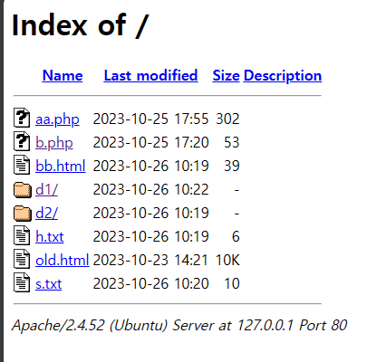
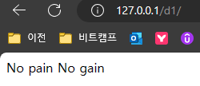
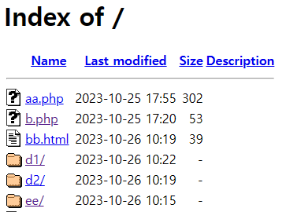
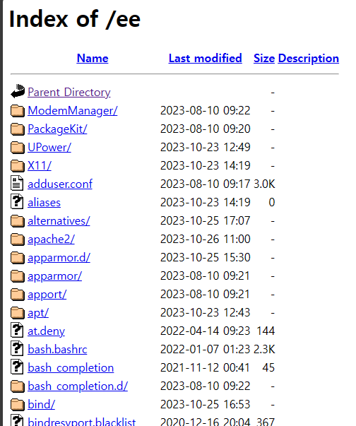
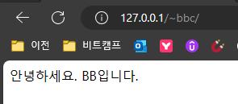
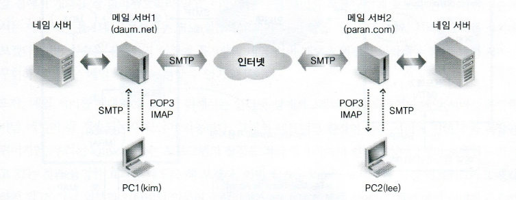

#### 리눅스 & php

```shell
root@aiur:~# cd /var/www/html
root@aiur:/var/www/html# mv index.html  bb.html
root@aiur:/var/www/html# mkdir d1 d2
root@aiur:/var/www/html# echo "hello" > h.txt
root@aiur:/var/www/html# echo "서울시" > s.txt
root@aiur:/var/www/html# echo "seoul" > d1/s1.txt
root@aiur:/var/www/html# echo "pusan" > d1/p1.txt
```



```shell
root@aiur:/var/www/html# echo "No pain No gain" > d1/index.html
```

* d1 폴더에 들어가면 바로 인덱스 파일을 읽어들임.



##### apache2.conf 내용 #1

```shell
root@aiur:/etc/apache2# vi apache2.conf

----
 80 DefaultRuntimeDir ${APACHE_RUN_DIR}
----
# 위 내용은 아래 경우를 설정한 내용
root@aiur:~# echo "$p_살아요"
살아요
root@aiur:~# echo "${p}살아요"
pusan살아요
```


```shell
root@aiur:/etc/apache2# nl ports.


     1  # If you just change the port or add more ports here, you will likely also
     2  # have to change the VirtualHost statement in
     3  # /etc/apache2/sites-enabled/000-default.conf

     4  Listen 80  # 포트번호 

     5  <IfModule ssl_module>
     6          Listen 443  # https
     7  </IfModule>

     8  <IfModule mod_gnutls.c>
     9          Listen 443
    10  </IfModule>

    11  # vim: syntax=apache ts=4 sw=4 sts=4 sr noet
    
 ```

##### apache2.conf 내용 #2

```shell
root@aiur:/etc/apache2# vi apache2.conf
   
165 <Directory /usr/share>
166     AllowOverride None
167     Require all granted
168 </Directory>

 #   심볼릭링크를 허용해준다. 허용해주기 싫으면 이 내용을 지우면 됨
170 <Directory /var/www/>
171     Options Indexes FollowSymLinks       
                # ↑ Indexes를 삭제하면 index파일이 없어서 목록처럼 뜨는 페이지가 나오지 않음.
172     AllowOverride None
173     Require all granted
174 </Directory>
```

*  심볼릭링크 걸어보기

```shell
root@aiur:/var/www/html# ls
aa.php  b.php  bb.html  d1  d2  h.txt  old.html  s.txt
root@aiur:/var/www/html# ln -s /etc ee
root@aiur:/var/www/html# l
합계 40K
-rw-r--r-- 1 root root  302 10월 25 17:55 aa.php
-rw-r--r-- 1 root root   53 10월 25 17:20 b.php
-rw-r--r-- 1 root root   39 10월 26 10:19 bb.html
drwxr-xr-x 2 root root 4.0K 10월 26 10:22 d1/
drwxr-xr-x 2 root root 4.0K 10월 26 10:19 d2/
lrwxrwxrwx 1 root root    4 10월 26 10:53 ee -> /etc/
-rw-r--r-- 1 root root    6 10월 26 10:19 h.txt
-rw-r--r-- 1 root root  11K 10월 23 14:21 old.html
-rw-r--r-- 1 root root   10 10월 26 10:20 s.txt
root@aiur:/var/www/html# file ee
ee: symbolic link to /etc
```





##### apache2.conf 내용 #3

* `%`로 시작하는건 모두 변수
* 아래 내용들이 로그파일로 저장

```shell
212 LogFormat "%v:%p %h %l %u %t \"%r\" %>s %O \"%{Referer}i\" \"%{User-Agent}i\    "" vhost_combined
213 LogFormat "%h %l %u %t \"%r\" %>s %O \"%{Referer}i\" \"%{User-Agent}i\"" com    bined
214 LogFormat "%h %l %u %t \"%r\" %>s %O" common
215 LogFormat "%{Referer}i -> %U" referer
216 LogFormat "%{User-agent}i" agent
```


```shell
root@aiur:/etc/apache2# nl magic
```


```shell
# 액세스 로그기록
root@aiur:/var/log/apache2# nl access.log

# 로그 기록 초기화
root@aiur:/var/log/apache2# 0>access.log


# 경로이 이동
root@aiur:/etc/apache2/sites-enabled# ls
000-default.conf
root@aiur:/etc/apache2/sites-enabled# l
합계 0
lrwxrwxrwx 1 root root 35 10월 23 14:21 000-default.conf -> ../sites-available/000-default.conf
root@aiur:/etc/apache2/sites-enabled# nl 000-default.conf
----
# html 파일이 어디에 있는지 설정하는 부분
11          DocumentRoot /var/www/html

# 에러파일 로그
17          ErrorLog ${APACHE_LOG_DIR}/error.log
18          CustomLog ${APACHE_LOG_DIR}/access.log combined #파일 로그 형식이 컴바인
----

# 컴파인 변경하기
root@aiur:/etc/apache2# vi apache2.conf

---
213 #LogFormat "%h %l %u %t \"%r\" %>s %O \"%{Referer}i\" \"%{User-Agent}i\"" combined
214 LogFormat "%t : 언제왔니" combined
---

# 다시 로그 띄워보기
root@aiur:/var/log/apache2# nl access.log  # 내가 편집한 내용을 변경됨.
```

#### 홈에 bbc 경로 추가하기

```shell
bbc@aiur:~$ mkdir public_html
bbc@aiur:~$ cat > public_html/index.html
<meta charset='utf-8'> 안녕하세요. BBC  입니다.


root@aiur:/etc/apache2/mods-available# nl userdir.conf
     1  <IfModule mod_userdir.c>
     2          UserDir public_html
     3          UserDir disabled root

     4          <Directory /home/*/public_html>
     5                  AllowOverride FileInfo AuthConfig Limit Indexes
     6                  Options MultiViews Indexes SymLinksIfOwnerMatch IncludesNoExec
     7                  Require method GET POST OPTIONS
     8          </Directory>
     9  </IfModule>

    10  # vim: syntax=apache ts=4 sw=4 sts=4 sr noet


root@aiur:/etc/apache2/mods-available# cd ../mods-enabled/

###### 중요 !!!!
root@aiur:/etc/apache2/mods-enabled# ln -s ../mods-available/userdir.conf   
root@aiur:/etc/apache2/mods-enabled# ln -s ../mods-available/userdir.load

root@aiur:/etc/apache2/mods-enabled# ls
access_compat.load  authz_core.load  deflate.load  mime.load         php8.1.load      status.load
alias.conf          authz_host.load  dir.conf      mpm_prefork.conf  reqtimeout.conf  userdir.conf  # 이 파일
alias.load          authz_user.load  dir.load      mpm_prefork.load  reqtimeout.load  userdir.load  # 이 파일 
auth_basic.load     autoindex.conf   env.load      negotiation.conf  setenvif.conf
authn_core.load     autoindex.load   filter.load   negotiation.load  setenvif.load
authn_file.load     deflate.conf     mime.conf     php8.1.conf       status.conf

# bbc 에서 홈디렉터리 권한 변경
bbc@aiur:~$ chmod 755 ~
```




```shell
root@aiur:/etc/apache2/mods-enabled# nl alias.conf

     1  <IfModule alias_module>
     2          # Aliases: Add here as many aliases as you need (with no limit). The format is
     3          # Alias fakename realname
     4          #
     5          # Note that if you include a trailing / on fakename then the server will
     6          # require it to be present in the URL.  So "/icons" isn't aliased in this
     7          # example, only "/icons/".  If the fakename is slash-terminated, then the
     8          # realname must also be slash terminated, and if the fakename omits the
     9          # trailing slash, the realname must also omit it.
    10          #
    11          # We include the /icons/ alias for FancyIndexed directory listings.  If
    12          # you do not use FancyIndexing, you may comment this out.

    13          Alias /icons/ "/usr/share/apache2/icons/"

    14          <Directory "/usr/share/apache2/icons">
    15                  Options FollowSymlinks
    16                  AllowOverride None
    17                  Require all granted
    18          </Directory>

    19  </IfModule>


root@aiur:/etc/apache2/mods-enabled# ls /usr/share/apache2/icons
a.gif            box1.gif        dvi.png          image2.gif         odf6odm.png        p.png       ps.gif       tex.png
a.png            box1.png        f.gif            image2.png         odf6odp-20x22.png  patch.gif   ps.png       text.gif
alert.black.gif  box2.gif        f.png            image3.gif         odf6odp.png        patch.png   quill.gif    text.png
alert.black.png  box2.png        folder.gif       image3.png         odf6ods-20x22.png  pdf.gif     quill.png    transfer.gif
alert.red.gif    broken.gif      folder.open.gif  index.gif          odf6ods.png        pdf.png     right.gif    transfer.png
alert.red.png    broken.png      folder.open.png  index.png          odf6odt-20x22.png  pie0.gif    right.png    ubuntu-logo.png
apache_pb.gif    burst.gif       folder.png       layout.gif         odf6odt.png        pie0.png    screw1.gif   unknown.gif
apache_pb.png    burst.png       folder.sec.gif   layout.png         odf6otc-20x22.png  pie1.gif    screw1.png   unknown.png
apache_pb.svg    c.gif           folder.sec.png   left.gif           odf6otc.png        pie1.png    screw2.gif   up.gif
apache_pb2.gif   c.png           forward.gif      left.png           odf6otf-20x22.png  pie2.gif    screw2.png   up.png
```


#### apache2 중요 경로

* 설정 파일 위치 : /etc/apache2/mods-enabled/
* 로그 파일 위치 : /var/log/apache2/
* 디폴트 파일 위치 : /var/www/html/


#### mysql 주요 에러 3가지 

```shell
ERROR 2002 (HY000): Can't connect to local MySQL server through socket '/var/run/mysqld/mysqld.sock' (2)

ERROR 1045 (28000): Access denied for user 'mysun'@'localhost' (using password: NO)

ERROR 1045 (28000): Access denied for user 'mysun'@'localhost' (using password: YES)
```


### MAIL 서버


* 메일 서버는 두가지 기능
  * 보내기
    * 내 PC -> 메일 서버 
    * 메일을 보낼 때 사용하는 프로토콜 SMTP
    * 네임서버 

  



```shell

root@aiur:~# vi /etc/host
-----
# 내용 추가하기
  3 127.0.1.1 korea.com
  4 127.0.1.1 seoul.kr
-----

# dovecot 설치 : 메일을 받아서 처리하는 것 
root@aiur:~# ai dovecot-imapd
```


```shell
root@aiur:~# mail
No mail for root

```

```shell
root@aiur:/etc/mail# ls
Makefile         aliases     local-host-names  sendmail.cf     service.switch-nodns  tls
access           aliases.db  m4                sendmail.conf   smrsh                 trusted-users
access.db        databases   peers             sendmail.mc     submit.cf
address.resolve  helpfile    sasl              service.switch  submit.mc
```

### ftp

```shell
ftp ftp.kaist.ac.kr
Name : ftp
pw : (엔터) 
ftp> cd  apache/httpd
ftp> get httpd-2.4.58.tar.gz
```


### 화면 텍스트를 파일로 저장하기

```shell
root@aiur:/etc/mail# scripts Last-1
```
