* [혹시 뭔가 안될 때 참고용 사이트](https://docs.3rdeyesys.com/compute/ncloud_compute_server_vpc_create.html)

### 즐겨찾기 설정

Service > 검색 > 즐겨찾기 설정

* VPC (Virtual Private Cloud)
  * 퍼블릭 클라우드 상에서 제공되는 고객 전용 사설 네트워크 공간
  * ACG 보안 : 퍼블릭 클라우드상에서도 엄격하게 적용됨.
  * 제한있음 (3-4개 정도?)
* Cloud DB for MySQL 
  * 데이터베이스 서비스를 쉽고 간편하게 구축하고 관리
* Server
  * 리눅스 서버 생성용

### vpc

#### 1. vpc 생성

* vpc Management

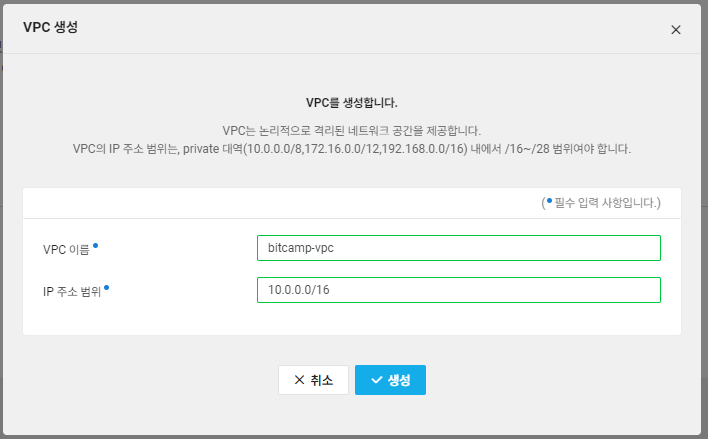

* vpc이름에 공백 불허

* 생성 > 상태 [생성 중] > (기다리면) 상태 [운영 중]으로 변경됨 

#### 2. Subnet 생성

* subnet Management

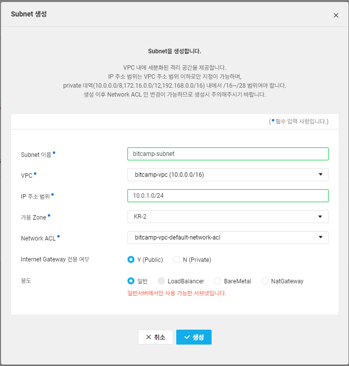

#### 3. Server 생성

1)  ACG 생성

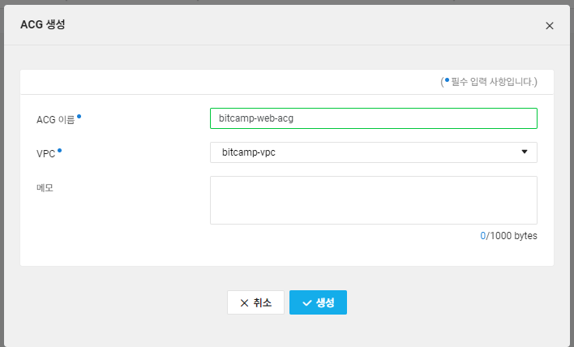

2) ACG Inbound 설정 

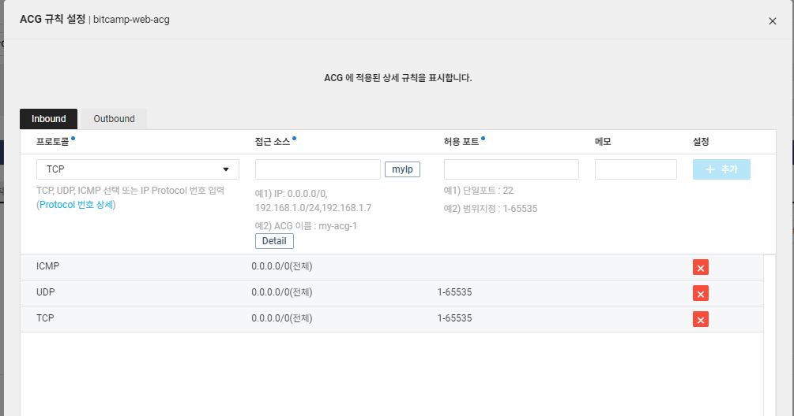

3) ACG Outbound 설정
  * Inbound 설정과 똑같이 설정

4) **VCP > Network ACL > ACL Rule**
  * 웹으로 들어오는 방화벽 설정

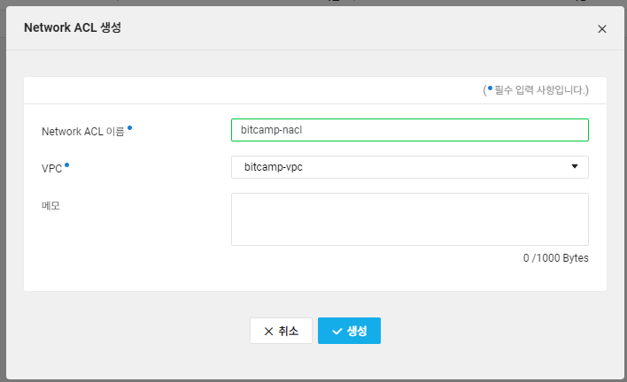

5) 기존 콘솔화면 

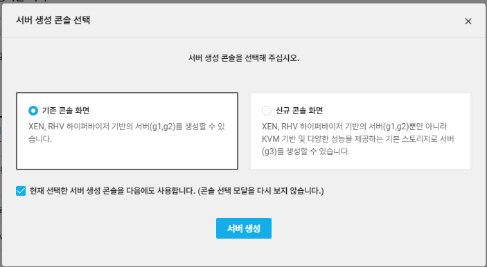

6) ubuntu 20 선택

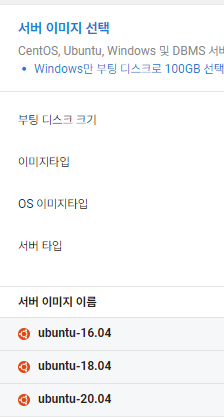

7) 서버 세부 설정

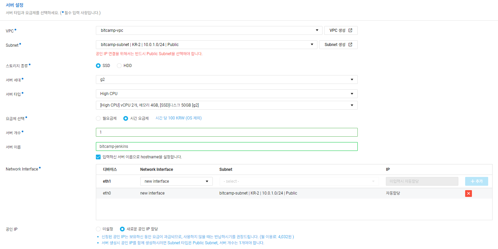

* eth0 은 별도 설정없이 [+추가]하기 
* 반드시 공인IP에서 **새로운 공인 IP할당**
* 나머지는 그대로

8) 인증키 설정

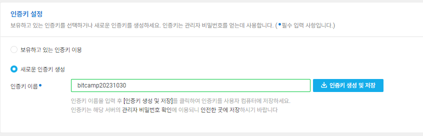

* 이름은 임의로 설정해도 됨.
* 생성 및 저장해서 파일을 잘 보관해 놓을 것 (또 만들면 서버부터 다 다시 만들어야함.)

9) 네트워크 접근 설정

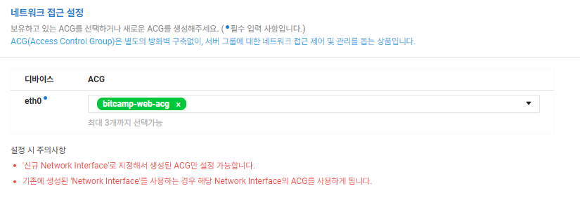

10) 최종 확인

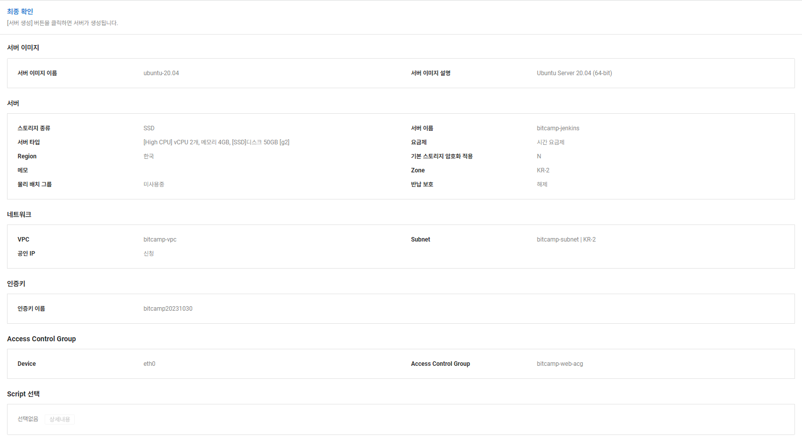

