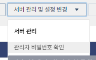
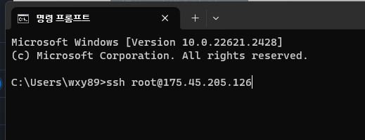
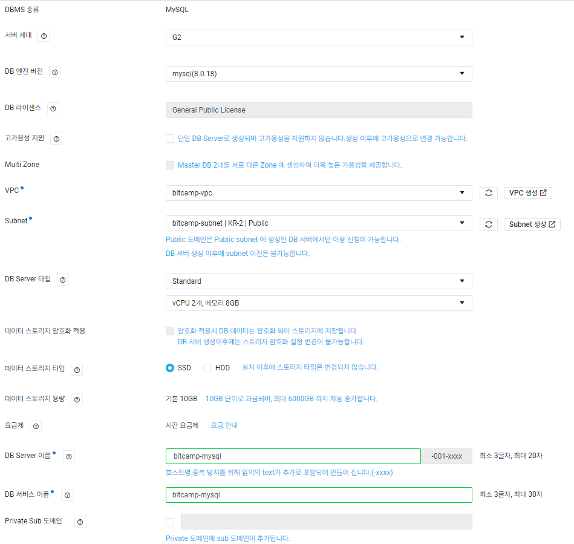
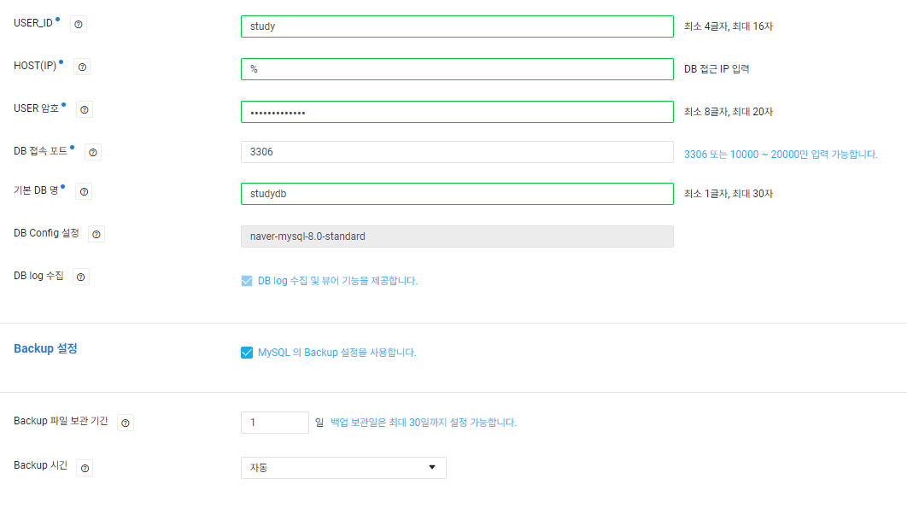
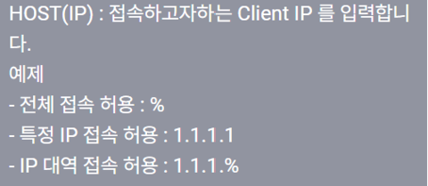
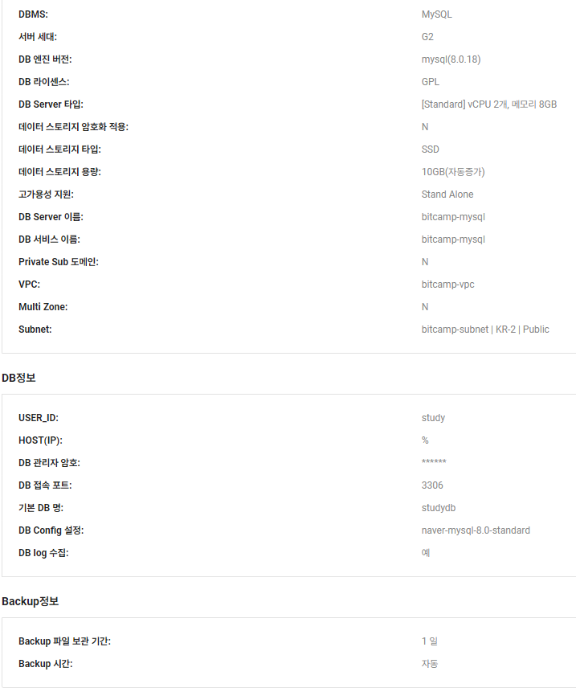
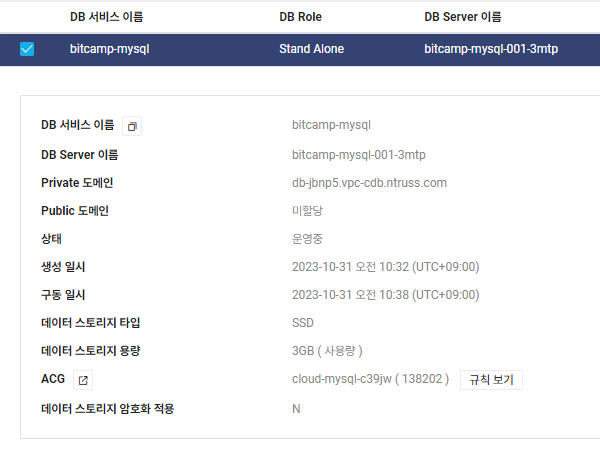
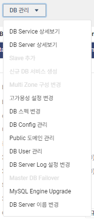
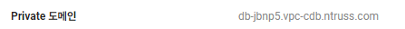
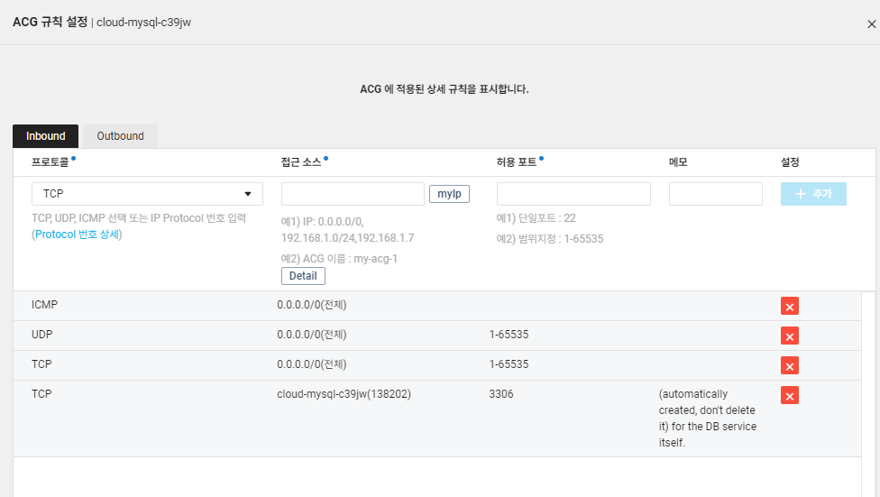

### 관리자 비밀번호 확인

* Server > 서버 관리 및 설정 변경



* 기존에 만들었던 pem파일 불러오기 
* 비밀번호 확인 > 복사해서 저장해놓기

### cmd 



* yes > 방금 전 비밀번호 넣기

* passwd > root 비밀번호 변경하기 

### Mysql 

* Cloud DB for MySQL에서 작업


#### DB 서버 생성







* % : 원격으로 접속할 때 접근 무조건 허용함




* 최종 정보



#### 퍼블릭 도메인 발급



* 퍼블릭 도메인이 미할당 되어있음




* DB관리 옵션 에서 > 퍼블릭 도메인 > 예



이렇게 변경된다.

#### ACG 추가 설정

* cloud-mysql  ACG 설정하기




#### 접속


```shell
# 1) 업데이트
:~# apt-get update
# 2) MYSQL 설치
:~# apt-get install mysql-client
```

* 설치 전 update를 해준다.
* mysql 설치


```shell
# 접속하는 방법
:~# mysql -h db-jbnp5-kr.vpc-pub-cdb.ntruss.com -u study -p
```

* `-h`: 호스트 주소. 퍼블릭 도메인 입력


#### 로컬계정에서 테스트


* DB 업로드하기

```shell
D:\naver0829>mysqldump -u root -p bit701>mysqlrootdb.sql
```

```shell
D:\naver0829>mysql -h db-jbnp5-kr.vpc-pub-cdb.ntruss.com -u study -p studydb < mysqlrootdb.sql

mysql> use studydb
Database changed
mysql> show tables;
+-------------------+
| Tables_in_studydb |
+-------------------+
| answersboard      |
| myshop            |
| simpleboard       |
| student           |
| test              |
+-------------------+
5 rows in set (0.01 sec)
```


