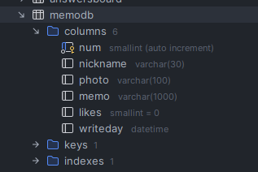
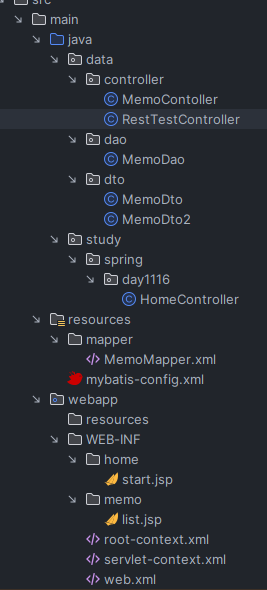
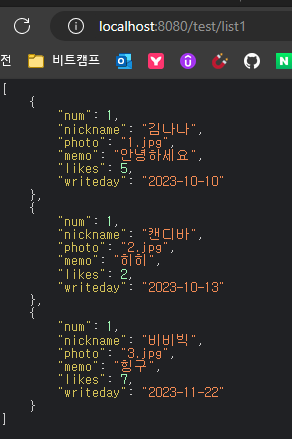
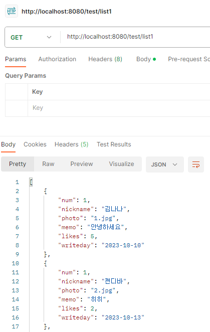
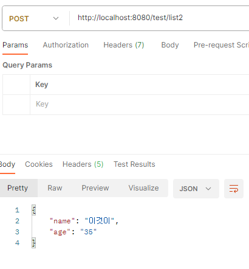

---
layout : single
title : "Spring │ MEMO #1"
categories : spring
tag : [spring,네이버클라우드캠프]
toc: true
toc_sticky: true
breadcrumb: true
---


### DB 테이블 생성

```mysql
CREATE TABLE memodb(
    num SMALLINT AUTO_INCREMENT PRIMARY KEY,
    nickname VARCHAR(30),
    photo VARCHAR(100),
    memo VARCHAR(1000),
    likes SMALLINT DEFAULT 0,
    writeday DATETIME
)
```



### 파일트리




### JSON 테스트1

```java
@Controller
public class RestTestController {

    @GetMapping("/test/list1")
    @ResponseBody  public List<MemoDto2> list1(){
    //위 어노테이션 빼먹지 말자 !
        List<MemoDto2> list = new ArrayList<>();
        list.add(new MemoDto2(1, "김나나", "1.jpg", "안녕하세요", 5, "2023-10-10"));
        list.add(new MemoDto2(1, "캔디바", "2.jpg", "히히", 2, "2023-10-13"));
        list.add(new MemoDto2(1, "비비빅", "3.jpg", "힝구", 7, "2023-11-22"));

        return list;
    }
}
```

* 결과




#### postman을 이용해서 JSON 데이터 보기




#### @ResponseBody 와 @RestController

* `@ResponseBody` : 메소드마다 매번 등록
* `@RestController`  : 클래스명에 한번만 등록

```java
@RestController  //왼쪽 어노테이션을 주면 메서드마다 @ResponseBody붙이는 것을 생략할 수 있다.
public class RestTestController {

    @GetMapping("/test/list1")
    public List<MemoDto2> list1() {

        List<MemoDto2> list = new ArrayList<>();
        list.add(new MemoDto2(1, "김나나", "1.jpg", "안녕하세요", 5, "2023-10-10"));
        list.add(new MemoDto2(1, "캔디바", "2.jpg", "히히", 2, "2023-10-13"));
        list.add(new MemoDto2(1, "비비빅", "3.jpg", "힝구", 7, "2023-11-22"));

        return list;
    }
}
```

### JSON 테스트2 : POST 방식으로 JSON 보내기

```java
@PostMapping("/test/list2")
public Map<String, String> text(){
    Map<String, String> map = new HashMap<>();
    map.put("name","이것이");
    map.put("age","35");

    return map;
}
```

* 포스트맨에서 http://localhost:8080/test/list2 넣고 [Send]




### 기본세팅

#### MemoDto

```java
@Data
@NoArgsConstructor
@AllArgsConstructor
public class MemoDto {
    private int num;
    private String nickname;
    private String photo;
    private String memo;
    private int likes;
    private Timestamp writeday;
}
```

#### MemoRestController

```java
@PostMapping("/memo/upload")
public String fileUpload(@RequestParam("upload") MultipartFile upload, HttpServletRequest request){
    
    //파일을 업로드할 위치
    System.out.println("업로드한 파일명 " + upload.getOriginalFilename());
    String path = request.getSession().getServletContext().getRealPath("/resources/upload");
    System.out.println(path);

    //랜덤 파일명
    String photo = UUID.randomUUID().toString();

    //업로드
    try {
        upload.transferTo(new File(path + "/" + photo));
    } catch (IllegalStateException e) {
        e.printStackTrace();
    } catch (IOException e) {
        e.printStackTrace();
    }

    return photo;
}
```

#### list.jsp 스크립트 영역

```html
<h3 class="alert alert-success">간단한 메모를 남겨봅시다</h3>
<div class="memoform">
    <span class="camraupload">📷</span>
    <input type="file" name="upload" id ="upload" style="display: none;">
    <br>
    
</div>
<div class = "memolist">
    memo list
</div>
```

     
* processData : 
  * false : 서버에 전달하는 데이터는 query string 이라는 형태로 전달된다. 파일전송의 경우 이를 하지 않아야하는데 그 설정이 false.
* contentType : 
  * false : enctype이 원래 기본값은 application/x-www..(생략) . multipart/form-data로 변경해준다.
   

```jquery-css
$(function (){
    $(".camraupload").click(function (){
        $("#upload").trigger("click");
    });

    $("#upload").change(function (){
       let form = new FormData();
       form.append("upload", $("#upload")[0].files[0]);

       $.ajax({
           type:"post",
           dataType:"text",
           url:"./upload",
           processData : false,
           contentType : false,
           data: form,
           success:function (res){
                alert(res);
           },
           statusCode:{
               404:function (){
                   alert("json 파일을 찾을 수 없어요");
               },
               500:function (){
                   alert("서버오류. 코드를 다시 한 번 보세요.");
               }
           }
       }) ;
    });
});
```

