### 메모 삭제

#### 1.

```xml
<delete id="deleteMemo" parameterType="int">
    DELETE FROM  memodb WHERE num = #{num}
</delete>
```

#### 2.

```java
public void deleteMemo(int num) {
    session.delete(nameSpace + "deleteMemo", num);
}
```

#### 3.

```java
@GetMapping("/memo/delete")
public void memoDelete(@RequestParam int num){
    memoDao.deleteMemo(num);
}
```

#### 4.


```javascript
//삭제 아이콘
<a href="#" class = "memodel" num = "\${item.num}" style="cursor: pointer; color: red;">삭제</a>
```

```javascript
//메인 함수 내
$(document).on("click",".memodel", function (){
   let num = $(this).attr("num");
   let a = confirm("삭제하려면 확인");

   if(a){
       $.ajax({
           type:"get",
           dataType:"text",
           url:"./delete",
           data : {"num":num},
           success:function (res){
               list();
           }
       }) ;
   }
});
```

### 추천수 증가

#### 1.

```xml
<update id="updateLikesByNum" parameterType="int">
    UPDATE memodb set likes = likes + 1 WHERE num = #{num}
</update>

<select id="countLikes" parameterType="int" resultType="int">
    SELECT likes FROM memodb WHERE num = #{num}
</select>
```


#### 2.

```java
public void updateLikes(int num) {
    session.update(nameSpace + "updateLikesByNum", num);
}

public int getCountLikes(int num) {
  return  session.selectOne(nameSpace + "countLikes", num);
}
```


#### 3.

```java
@GetMapping("/memo/likes")
public Map<String, Integer> countLikes(@RequestParam int num){
    //좋아요 수 증가
    memoDao.updateLikes(num);

    //증가된 좋아요 수 얻기
    int likes = memoDao.getCountLikes(num);

    Map<String, Integer> map = new HashMap<>();
    map.put("likes", likes);

    return map;
}
```

#### 4.

```javascript
추천수 : <span>\${item.likes}</span><span class="increlikes" style = "cursor:pointer;" num = "\${item.num}">💙</span><br>
```

```javascript
//좋아요 수 증가
$(document).on("click",".increlikes",function (){
   let num = $(this).attr("num");
   let $prev = $(this).prev();
   $.ajax({
       type:"get",
       dataType:"json",
       url:"./likes",
       data : {"num": num},
       success:function (res){
           $prev.text(res.likes);
       }
   });
});
```


### 네이버

* 즐겨찾기 추가
  * Bucket Managment
  * Image Optimizer
  * Global Edge


오브젝트 스토리지 > 버킷 생성 > 버킷 이름 (bitcamp701) > 다음 > 다음 > 공개  >


이미지옵티마이저


### Bucket Managment

* 이용 신청 > 버킷생성 누르기

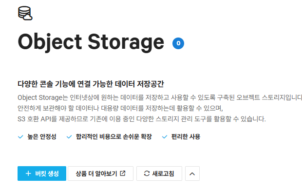


*** 버키생성 과정 다시 정리하식


* 새폴더 -> photo (더블클릭)

* 들어가면 우측상단에 현재 경로가 나타난다.

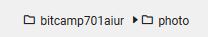

* 업로드 > [권한 및 메타 데이터 설정] > 모두에게 공개하기 (공개) > 확인

* 이미지를 더블클릭하면 경로가 나온다.

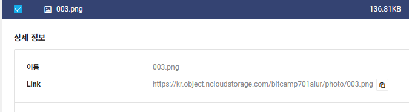


### Global Edge 프로필 생성

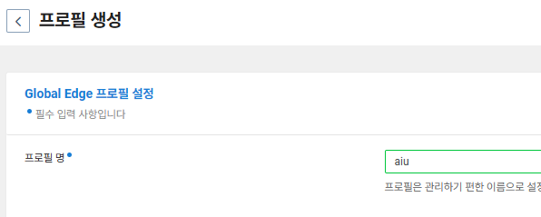

### Image Optimaizer 세팅

* 얼굴 사진일 경우 얼굴을 영역을 인식해서 정사각형으로 자동으로 맞춰줌.

1. 프로젝트 생성


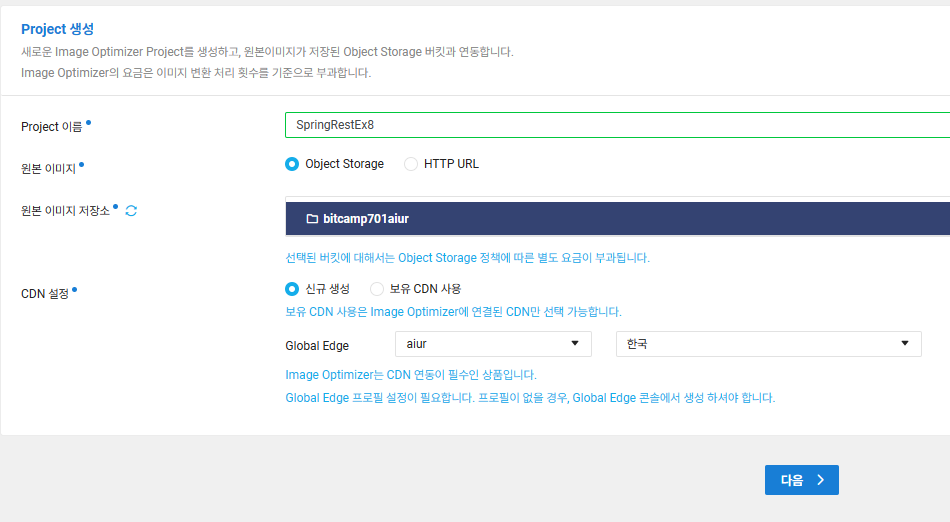


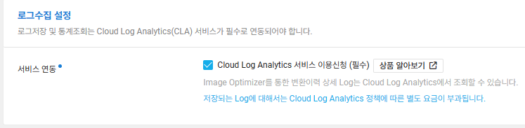

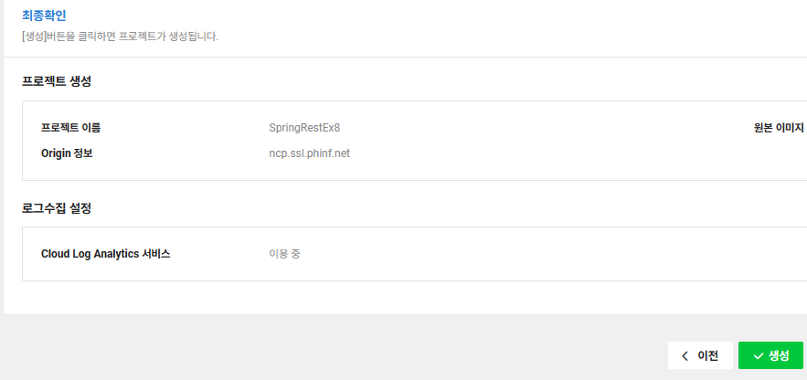


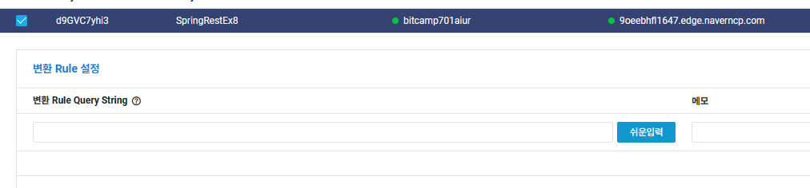

* 쉬운입력 클릭

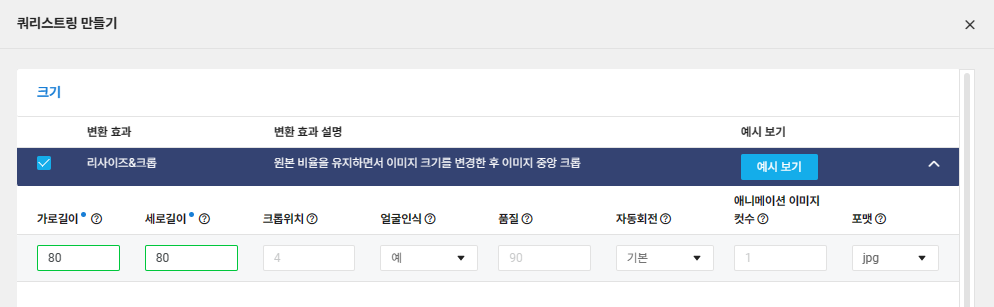

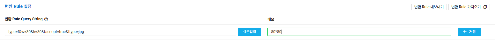

* 메모넣고 저장

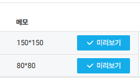

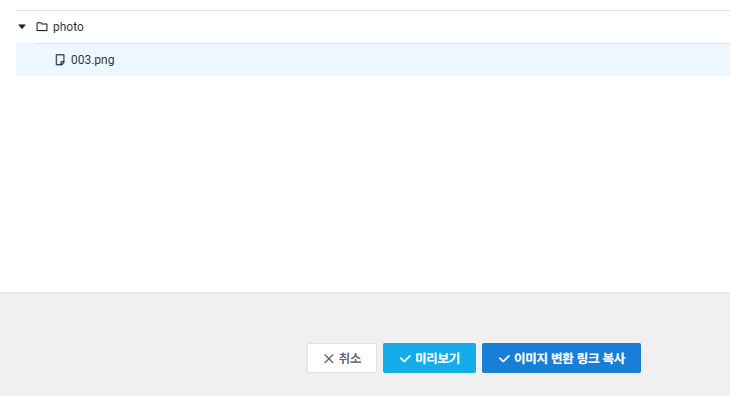

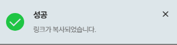


###  네이버 연결


#### 
* 굿어스 데이터 > 계정관리

* 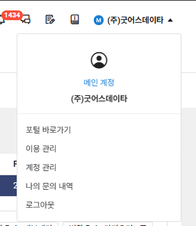

* 인증키 관리 > 액세스키 + 시크릿키 확인가능.


#### pom.xml 에 의존성 추가

```javascript
<dependency>
    <groupId>io.awspring.cloud</groupId>
    <artifactId>spring-cloud-starter-aws</artifactId>
    <version>2.4.4</version>
</dependency>
<dependency>
        <groupId>com.amazonaws</groupId>
        <artifactId>aws-java-sdk-s3</artifactId>
        <version>1.12.416</version>
</dependency>
```
