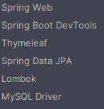
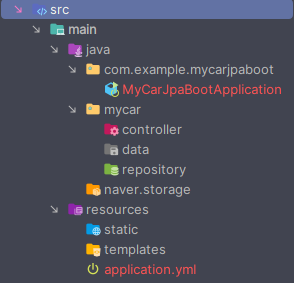

#### 외부 인증키 설정

인증키는 노출이 되면 안되므로 properties파일에 모아 작성 후 

```properties
ncp.accessKey=8WkR3bZnWbDIyydbmk8t
ncp.secretKey=9xw3qYYmxXHWiHMprko5tCZKaFs0AcgdMXJQFifA
ncp.regionName=kr-standard
ncp.endPoint=https://kr.object.ncloudstorage.com
```

```java
@Getter
@ConfigurationProperties(prefix="ncp")  // 2. 'ncp'로 시작하는 값들만 불러오게 함.
@PropertySource("classpath:/naver.properties") // 1. properties 파일 경로 지정
@Configuration
public class NaverConfig {
    private String endPoint;
    private String regionName;
    private String accessKey;
    private String secretKey;
}
```

#### thymeleaf Object로 전달

```html
<!--  기존  -->
[[${dto.sangpum}]]
```

### JPA

#### 프로젝트 생성

의존성 추가 




#### 패키지 구조



#### main 에 어노테이션 추가

```java
@SpringBootApplication
@ComponentScan({"mycar.*", "naver.storage"})
@EntityScan("mycar.data")
@EnableJpaRepositories("mycar.repository")
public class MyCarJpaBootApplication {
    public static void main(String[] args) {
        SpringApplication.run(MyCarJpaBootApplication.class, args);
    }
}
```


#### application.yml 에 세팅

```yaml
#Mysql/JPA Setting
spring:
  dataSource:
    driver-class-name: com.mysql.cj.jdbc.Driver
    url: jdbc:mysql://db-jbnp5-kr.vpc-pub-cdb.ntruss.com:3306/studydb?serverTimezone=Asia/Seoul
    username: study
    password: bitcamp123!@#
  jpa:
    hibernate:
      ddl-auto: update #update: 변경된 부분만 반영, create: 기존 테이블을 삭제 후 생성.
    generate-ddl: true #ddl 생성시 DB 고유의 기능을 사용할 것인가
    show-sql: true #api 호출시 실행되는 sql문을 콘솔에 나타내도록 설정
    database-platform: org.hibernate.dialect.MySQL57Dialect 
```

* `ddl-auto : create`의 경우 DB 데이터를 모두 삭제 후 생성하기 때문에 유의할 것.

### JPA CRUD

JPA에는 기본 CRUD 기능을 지원함. 복잡한 쿼리의 경우 직접 작성

#### dto 생성

```java
@Entity
@Table(name = "mycar")
@Data
@Builder
@NoArgsConstructor
@AllArgsConstructor
public class MyCarDto {

    @Id //각 엔터티를 구별할 수 있는 식별자
    @GeneratedValue(strategy = GenerationType.IDENTITY)  //자동으로 auto increment를 하기 위한 설정
    private Long num;

    @Column(name="carname", length = 30) //변수명과 동일할 경우 name 생략 가능
    private String carname;

    private int carprice;

    @Column(length = 20)
    private String carcolor;

    @Column(length = 30)
    private String carguip;

    @Column(length = 100)
    private String carphoto;

    @Column(updatable = false) //해당 컬럼은 수정시에 제외시킴
    @CreationTimestamp
    private Timestamp writeday;

    @Transient // 테이블의 컬럼으로는 생성되지 않고, 객체에섬난 사용가능한 멤버 변수
    private int commnetcount;

    @Transient
    private String message;
}
```

#### interface 생성

```java
public interface MyCarDaoInter extends JpaRepository<MyCarDto, Long> {
 // 
}
```

#### MyCarDao

```java
@Repository
@AllArgsConstructor
public class MyCarDao {

    //JpaRepository를 상속받을경우 기본적인 SQL을 실행해주는 각종 메서드 호출 가능
    MyCarDaoInter daoInter;
    
    //SELECT
    public Long getTotalCount() {
        return daoInter.count();
    }
    
    //INSERT
    public void insert(MyCarDto dto) {
      //save : @Id 식별자가 form 안에 없으면 insert 실행, 있으면 update를 수행한다.
      daoInter.save(dto);
    }
    
    //UPDATE
    public void update(MyCarDto dto) {
      daoInter.save(dto);
    }
    
}
```

```html

```

### Pagable (JPA 지원)


