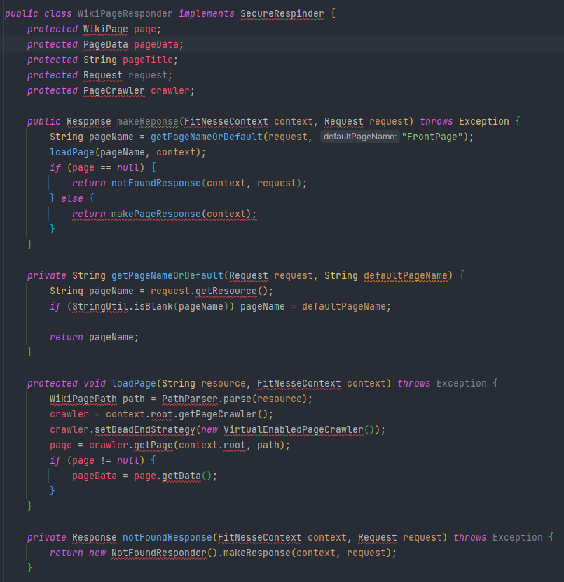
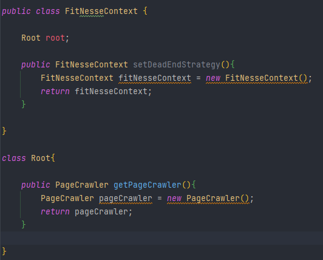
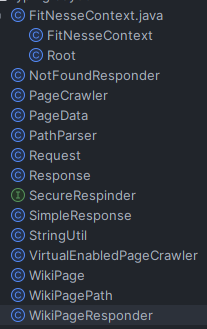
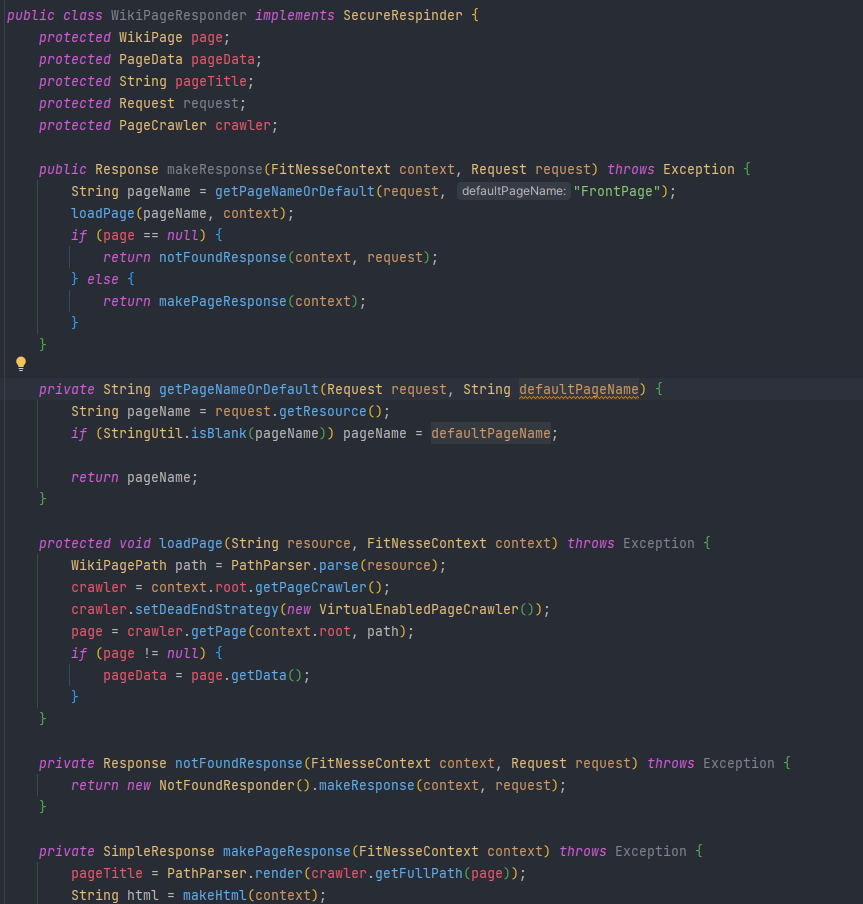

> 코드 참조 : CleanCode 139p-140p

```java
public class WikiPageResponder implements SecureRespinder {
    protected WikiPage page;
    protected PageData pageData;
    protected String pageTitle;
    protected Request request;
    protected PageCrawler crawler;

    public Response makeResponse(FitNesseContext context, Request request) throws Exception {
        String pageName = getPageNameOrDefault(request, "FrontPage");
        loadPage(pageName, context);
        if (page == null) {
            return notFoundResponse(context, request);
        } else {
            return makePageResponse(context);
        }
    }

    private String getPageNameOrDefault(Request request, String defaultPageName) {
        String pageName = request.getResource();
        if (StringUtil.isBlank(pageName)) pageName = defaultPageName;

        return pageName;
    }

    protected void loadPage(String resource, FitNesseContext context) throws Exception {
        WikiPagePath path = PathParser.parse(resource);
        crawler = context.root.getPageCrawler();
        crawler.setDeadEndStrategy(new VirtualEnabledPageCrawler());
        page = crawler.getPage(context.root, path);
        if (page != null) {
            pageData = page.getData();
        }
    }

    private Response notFoundResponse(FitNesseContext context, Request request) throws Exception {
        return new NotFoundResponder().makeResponse(context, request);
    }

    private SimpleResponse makePageResponse(FitNesseContext context) throws Exception {
        pageTitle = PathParser.render(crawler.getFullPath(page));
        String html = makeHtml(context);

        SimpleResponse response = new SimpleResponse();
        response.setMaxAge(0);
        response.setContent(html);
        return response;
    }

    //이 부분은 빨간줄을 없애기 위해 임의로 만든 것.
    private String makeHtml(FitNesseContext context) {
        String string = "";
        return string;
    }
}
```

좋은 코드를 어디서 찾아야하나 고민을 했는데, 클린코드 책에 나와 있는 예문 중 좋다고 언급된 코드를 써봐야겠다고 생각했다. 그러나..

> 제대로 입력됐는지 검증하려니 아래처럼 빨간줄 투성이였다.




> 그래서 일단 처음이기도하고 감을 좀 잡아보려고 일단 클래스를 별도로 다 만들어봤다.



단순 빨간 줄을 없애는 것이 목표였으므로 메서드 반환 타입만 맞게 구현했다.



> 모든 빨간 줄 없애기 성공




느낀 점은 앞으로는 가능하면 모든 클래스가 채워져 있는 코드를 찾아야 할 것 같다.

결과값을 테스트 해볼 수 없어서 조금 아쉽다.
