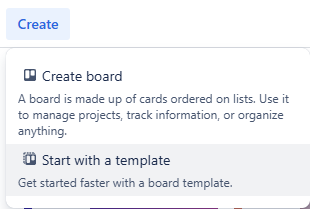
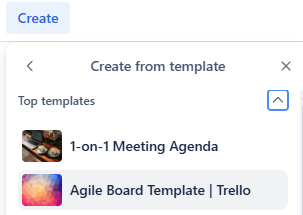
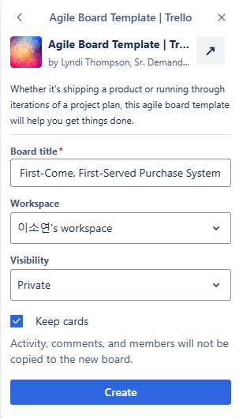
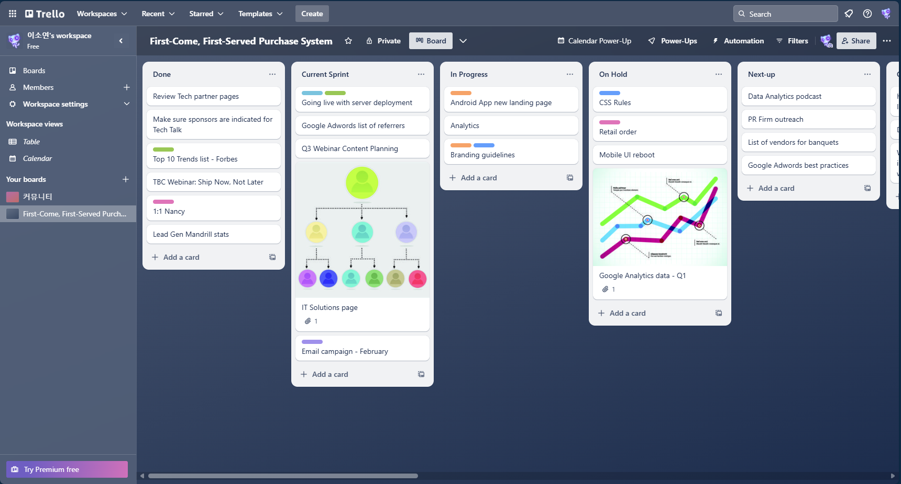
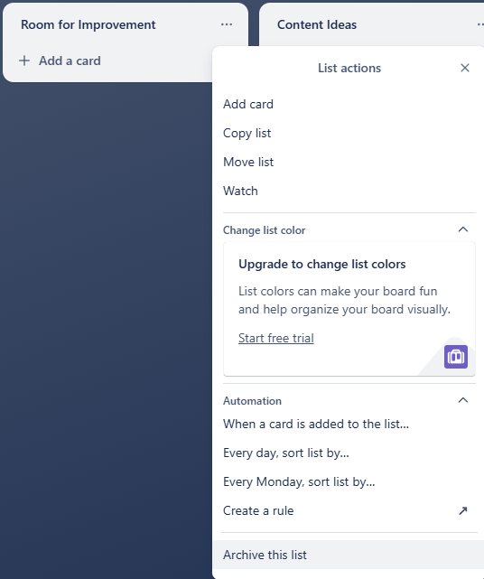
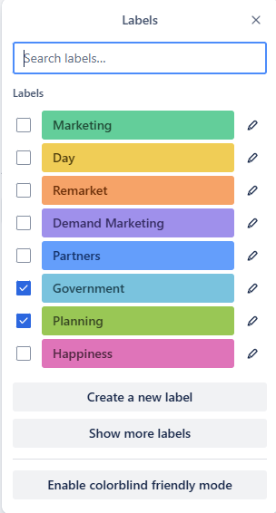
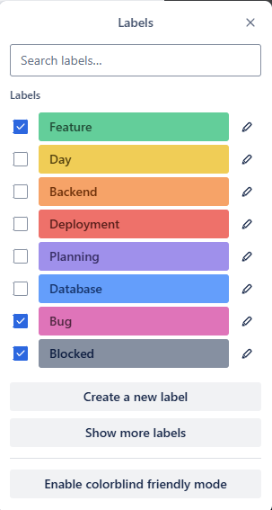
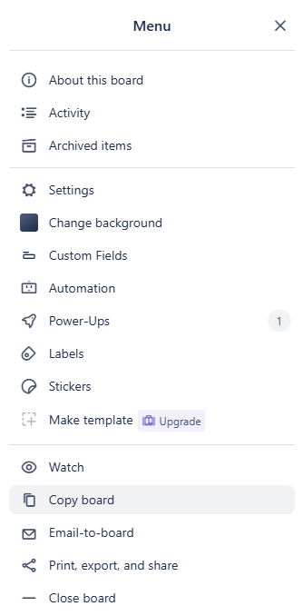
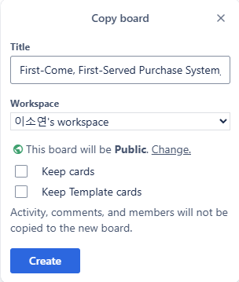
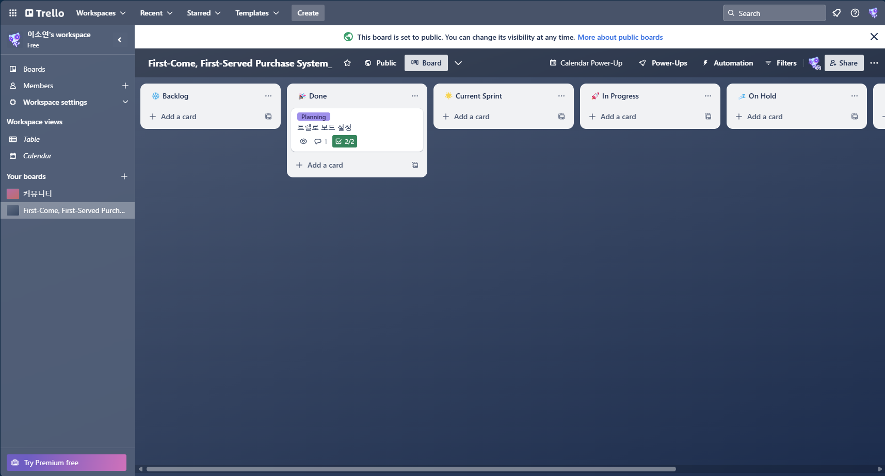

이전 프로젝트에서 간단하게 트렐로를 세팅한 경험이 있다. 전체 진행 상황, 멤버별 To-Do와 카드 이동 시 다양한 트리거 설정 등을 사용해보았다. 하지만 실제 프로젝트에서 어떻게 활용할지 명확하지 않아, 이번에는 개인 프로젝트를 진행하며 트렐로를 다시 활용해보기로 했다.

### 트렐로 템플릿으로 시작하기

내 개인프로젝트에 어떤 템플릿이 적절할까?

1. 주간 목표 설정
   * 총 기간 4주
   * 매주 새로운 목표를 설정하여 스프린트로 관리
2. 진행 상황 관리
   * 작업을 'In Progress'에서 'Done'으로 이동하며 진행 상황을 관리
   * 단순 Todo 리스트가 아닌, 우선순위를 체계적으로 설정하고 관리
   * 보다 시각적으로 할 일을 간단히 정리할 수 있도록 함
3. 개인 프로젝트로 커스텀
   * 개인 프로젝트의 특성에 맞춰 애자일 방법론을 효과적으로 적용하여 진행

위 사항들을 고려하여 `Agile Board Template`를 적용하기로 했다.

* Trello > Create > Start with a Template > Agile Board Template


자주 사용하는 템플릿인지 상단에 위치해있다.


프로젝트 이름은 추후 결정하기로 하고, private와 keep cards를 선택 후 생성했다. (공개여부는 추후 public으로 변경함)

'keep cards'를 선택하면 샘플 카드들을 볼 수 있다.

생성된 트렐로다.

### 트렐로 목록 세팅

목록을 보면 개인 프로젝트에는 필요 없는 마케팅 관련 내용들이 보인다. 목록을 정리해보기로 했다. 생성 시 기본 목록은 다음과 같다.

기본 목록

|             목록              | 용도                |
|:---------------------------:|:------------------|
|            Done             | 완료된 작업을 저장하는 목록   |
|       Current Sprint        | 현재 스프린트에 포함된 작업   |
|         In Progress         | 진행 중인 작업          |
|           on Hold           | 보류된 작업            |
|           Next-up           | 다음에 할 작업          |
|          Question           | 질문이나 불확실한 사항      |
|  Marketing Ideas - Icebox   | 마케팅 아이디어를 보관하는 목록 |
|         Junk Drawer         | 정리되지 않은 잡다한 항목    |
|    Room for Improvement     | 개선이 필요한 항목        |
|        Content Ideas        | 콘텐츠 아이디어          |
|   Awesome Things - WINS!    | 성취한 멋진 일들         |
| Would Love to Do - Manifest | 하고 싶은 일들의 목록      |
|          Resources          | 참고 자료                  |

협업과 마케팅 관련된 부분은 이번 프로젝트에서는 필요 없으므로 다음과 같이 정리했다.

수정 목록

|            목록            | 용도                                                      |
|:------------------------:|:--------------------------------------------------------|
|        ❄️ Backlog        | 앞으로 해야 할 모든 작업이 모여 있는 곳   우선순위를 정하고 준비              |
|    🌟 Current Sprint     | 스프린트에서 처리할 중요한 작업들 (주 단위로 등록)                           |
|      🚀 In Progress      | 현재 작업하고 있는 일                                            |
|        💤 On Hold        | 막히거나 나중에 다시 보고 싶은 작업                                    |
|         🎉 Done         | 완료된 결과물들                                                |
|      ❓ Questions        | 프로젝트 진행 중에 생기는 모든 질문이나 문제들을 기록   아이디어가 있을 경우 여기에 기록 |


또한 귀여운 이모티콘을 추가하여 목록을 정리했다.


사용하지 않는 목록 정리

* 사용하지 않을 목록은 목록에서 우측 상단 옵션을 누르고 'Archive this list'를 눌러 아카이브로 보낸다.
* 목록은 아카이브에 보관되며, 보드 설정 > 'Archived items'에서 다시 되돌릴 수 있다.
* 템플릿으로 생성한 경우 목록 삭제는 불가능하다. 다 정리된 보드를 보드 옵션 > 'Copy board' 하면 된다. (아니면 새로 만들어 처음부터 세팅할 수도 있다.)

### 트렐로 라벨 세팅

이번엔 라벨이다. 역시 내 프로젝트에 맞게 재구성할 것이다.

기본 라벨

수정 라벨

라벨 용도

|             라벨             | 용도                                         |
|:--------------------------:|:-------------------------------------------|
|     Feature 기능 개발      | Service 그 이하 작업                            |
|   API  API 개발 및 문서화    | Controller 작업                              |
|    Backend  백엔드 관련     | 서버 설정, 최적화, 환경설정                           |
|       Bug  버그 수정       | 오류수정, 응답 지연, 쿼리 성능 해결 등                    |
| Database  데이터베이스 설계,연동 | 전반적인 DB 설정                                 |
|    Testing  테스트 관련     | 유닛 테스트, 통합테스트 등 TDD주도 개발 실현을 위해..          |
|   Deployment  배포 관련    | 도커, 컴포즈, CI/CD 등                           |
|  Planning  프로젝트 계획,설계  | 스프린트 계획, 요구사항 분석, 타임라인 + 마일스톤 설정           |
|   Blocked  진행이 막힌 작업   | 외부 API 응답 지연등으로 쓰인다고하지만, 그 외 사항으로 사용될 것 같음 |
|   Day  데일리 작업을 구분   | 요일별 해야하는 작업을 구분, 써보고 싶어서 남겨두었다.            |

### Copy Board


여기까지 해놓고, 아카이브에 쌓인 프로젝트와 상관없는 카드들과 목록들이 마음이 걸려 결국 'Copy board'를 선택했다.


우측 상단 보드 옵션 > 'Copy Board'

새로 생성하면서 템플릿 카드는 모두 제외시키고, 공개 여부도 public으로 수정했다.

룰 적용이 되어 있는 것은 아니라서, 새로 생성하는 게 더 빠를 수도 있다. 하지만 애자일 협업 보드를 탐색하고 커스텀해서 사용하기 위해서는 템플릿을 들여다봐야 했다.

### 초기 세팅 완료

이렇게 해서 트렐로의 초기 세팅을 마쳤다. 개인 프로젝트를 효율적으로 관리하고, 트렐로의 다양한 기능을 최대한 활용할 수 있도록 노력해야겠다.