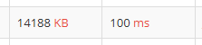

## 문제

#### 문제

두 정수 A와 B가 주어졌을 때, A와 B를 비교하는 프로그램을 작성하시오.

#### 입력

첫째 줄에 A와 B가 주어진다. A와 B는 공백 한 칸으로 구분되어져 있다.

#### 출력

첫째 줄에 다음 세 가지 중 하나를 출력한다.

* A가 B보다 큰 경우에는 '>'를 출력한다.
* A가 B보다 작은 경우에는 '<'를 출력한다.
* A와 B가 같은 경우에는 '=='를 출력한다.

#### 조건

-10,000 ≤ A, B ≤ 10,000

-----------------

## 풀이 과정

처음 코드는

1. scanner를 이용하여 두 정수를 입력
2. split을 활용하여 공백을 제외하여 String 배열 생성
3. 0번과 1번 배열의 요소를 Integer형으로 변환
4. 삼항연산자를 이용해서 조건에 맞는 출력 값 반환

이렇게 하였다. 


오늘 sw님과 얘기를 나누는데 문자열을 다룰 때 input, output은 scanner와 println보다는 BufferedReader와 BufferedWriter를 사용하라고 얘기해주셨다.
초급 문제는 상관없지만 후일 대량 문자열 처리를 할 때 메모리와 시간이 초과되는 것을 방지해 준다고 한다.

위 코드에 적응하기 위해 바로 사용해보기로 했다.

---


* 초기화 순서
  * BufferedReader → BufferedWriter

* 종료 순서
  * BufferedWriter → BufferedReader

### BufferedReader

```java
//선언
BufferedReader br = 
        new BufferedReader(new InputStreamReader(System.in));

//종료
br.close();
```

`BufferedReader` 는

* 문자 입력 스트림에서 문자를 효율적으로 읽기 위해 사용한다.
* 콘솔이나 파일로부터 입력을 빠르게 읽어들일 수 있다.


BufferedReader의 `매개변수`는 문자데이터를 읽기 위한 추상 클래스인 'Reader'를 받는데, 
파일/문자열/키보드 입력 등의 입력 소스를 지원한다.

  * 파일 : FileReader("파일명.txt")
  * 문자열 : StringReader("예제 텍스트");
  * 키보드 입력 : InputStreamReader(System.in)

scanner 대신으로는 `InputStreamReader`를 사용하면 된다.


### BufferedWriter


```java
// 선언
BufferedWriter bw = 
        new BufferedWriter(new OutputStreamWriter(System.out));

// 종료
bw.close();
```

`BufferedWriter`는

* 문자 출력 스트림에서 문자를 효율적으로 쓰기(write) 위해 사용한다.
* 콘솔이나 파일로 출력할 때 빠르게 데이터를 쓸 수 있다.

BufferedWriter의 `매개변수`는 문자 데이터를 쓰기 위한 추상 클래스인 'Writer'를 받는데, 이 또한 파일/문자열/콘솔 출력 등의 출력 소스를 지원한다.

* 파일 : FileWriter("파일명.txt")
* 문자열 : StringWriter()
* 콘솔 출력 : OutputStreamWriter(System.out)


코딩테스트는 콘솔 출력이므로 OutputStreamWriter를 사용할 것이다.

---

### 입출력 스트림과 버퍼 관리

`BufferedReader`와 `BufferedWriter`는 자바에서 효율적으로 데이터를 읽고 쓰기 위해 사용하는 클래스들이다.
버퍼를 사용하여 데이터를 효율적으로 처리하고, `System.in`과 `System.out`과 같은 표준 입출력 스트림을 활용할 수 있다.

#### 버퍼

BufferedReader와 BufferedWriter는 다음처럼 선언도 할 수 있는데,

```java
BufferedReader br = 
        new BufferedReader(new InputStreamReader(System.in), 8192);

BufferedWriter bw =
        new BufferedWriter(new OutputStreamWriter(System.out), 8192);
```

두번째 매개변수는 '버퍼' 크기이다.

BufferedReader나 BufferedWriter는 한 번에 데이터를 읽고 처리하는 것이 효율적인데 이러한 처리를 도와주는 것이 `버퍼`이다.
버퍼를 설정하지 않으면 기본값으로 8192 바이트(8KB)가 할당되는데 일반 파일 읽기/쓰기 작업에서 충분히 효율적인 값이라고 한다.

아래는 가볍게 읽고 넘어가자.

* 16KB 버퍼 : 대용량 로그 파일 분석
* 32KB 버퍼 : 대용량 파일 다운로드, 스트리밍 데이터 처리
* 64KB 버퍼 : 데이터베이스 백업 복원, 대규모 데이터 마이그레이션
* 128KB 버퍼 : 고성능 컴퓨팅 환경, 대규모 분산 시스템에서 데이터 처리


#### System.in

기본적으로 콘솔 '입력'을 처리하는 바이트 스트림이다. 'System.in'의 타입은 InputStream인데 데이터를 읽기 위해서는 InputStreamReader와 같은 변환 클래스가 필요하다. (바이트 스트림 → 문자 스트림 변환)


#### System.out

기본적으로 콘솔 '출력'을 처리하는 바이트 스트림이다. 'System.out'의 타입은 PrintStream인데 데이터를 읽기 위해서는 OutputStreamWriter와 같은 변환 클래스가 필요하다. (바이트 스트림 → 문자 스트림 변환)


#### write()

데이터를 버퍼에 쓸 때 사용한다. 즉시 출력되지는 않고 버퍼에 쌓인다.

#### flush()

BufferedWriter는 데이터를 버퍼에 모아두고, 버퍼가 가득 차면 한 번에 데이터를 출력하는데, 이게 가장 효율적인 출력방법이라고 한다.

그러나 프로그램이 버퍼가 가득 차기 전에 데이터를 즉시 출력해서 보고싶을 때 flush()를 호출하여 버퍼에 있는 모든 데이터를 강제로 출력 스트림에 쓰도록 할 수 있다.

#### 왜 가비지컬렉터로 처리하지 않고 close()를 해줘야할까?

가비지 컬렉터는 객체가 더 이상 참조되지 않을 때 메모리를 해제하는 역할을 한다.
하지만 BufferedReader와 BufferedWriter는 운영체제 자원(예: 파일 핸들, 소켓 등)을 사용하기 때문에 자동으로 해제할 수 없어 명시적으로 close()를 해줘야한다.

### StringTokenizer

```java
//초기화
StringTokenizer st = new StringTokenizer(br.readLine());

//공백 파싱 초기화
StringTokenizer st = new StringTokenizer(br.readLine()," ");
```

* 문자열을 구분자로 분리하여 토큰 단위로 나누기 위해 사용된다.
* 입력된 문자열을 공백이나 특정 문자를 기준으로 문자열을 분리(파싱)할 수 있다.


#### 문자열을 토큰화?

Token의 뜻은 "표시", "증표" 를 의미하지만, 프로그램에서는 `의미를 가지는 가장 작은 단위` 로 이해하면 된다고 한다.


ex1) `Hellow, World!`를 공백 기준으로 토큰화 하면 아래처럼 나눌 수 있다.

* Hellow,
* World!

ex2) `int x = 5;` 를 토큰화 하면 아래처럼 나눌 수 있다.

* int
* x
* =
* 5
* ;


#### 토큰화된 문자 데이터 꺼내기

```java
//st의 첫번째 토큰 값 할당
String A = st.nextToken();

//st의 두번째 토큰 값 할당
String B = st.nextToken();
```

#### StringTokenizer의 다른 유용한 메서드들

1. hasMoreTokens() / hasMoreElements() : 남아 있는 토큰이 있는지 확인해준다.
   * return: 토큰이 남아 있으면 true, 그렇지 않으면 false를 반환.


2. nextToken(String delim) : 다음 토큰을 반환하고, 지정된 구분자를 사용하여 문자열을 다시 토큰화
   * param: 새로 사용할 구분자 문자열 (delim).
   * return: 다음 토큰을 반환.

3. countTokens(): 현재 토큰 수를 반환
    * return: 남아 있는 토큰의 수


## 문제 풀이

이제 사용법을 알았으니 적용해 보자.

```java
// 필요한 import 문을 추가하는 것을 잊지 말자.
import java.io.*;
import java.util.StringTokenizer;

public class BJ_1330 {
     // 입출력 스트림을 사용할 때에는 IOException 예외처리를 해야한다.
    public static void main(String[] args) throws IOException {

        // 필요한 클래스들 초기화
        BufferedReader br 
                = new BufferedReader(new InputStreamReader(System.in));
        BufferedWriter bw 
                = new BufferedWriter(new OutputStreamWriter(System.out));
        StringTokenizer st 
                = new StringTokenizer(br.readLine(), " ");

        // 토큰화된 값을 Integer 타입으로 변환하여 할당
        int A = Integer.parseInt(st.nextToken());
        int B = Integer.parseInt(st.nextToken());

        // 조건 처리
        String result = A > B ? ">" : A < B ? "<" : "==";
        
        // result 값을 버퍼에 모으기
        bw.write(result);

        // 강제로 버퍼를 비워 데이터 출력
        bw.flush();
        
        // 자원 해제 해주기
        bw.close();
        br.close();
    }
}
```

## 결과

* 메모리 / 시간 - `scanner` 사용


* 메모리 / 시간 - `BufferedReader`, `BufferedWriter` 사용



0.192초와 0.1초

사림이 느끼기에는 무시할 수준이지만 차이가 있긴하다. 기초 문제라서 그런지 두 코드가 성능면에서 당장 큰 차이는 없는 것으로 보인다.

꾸준히 사용해보자😊


