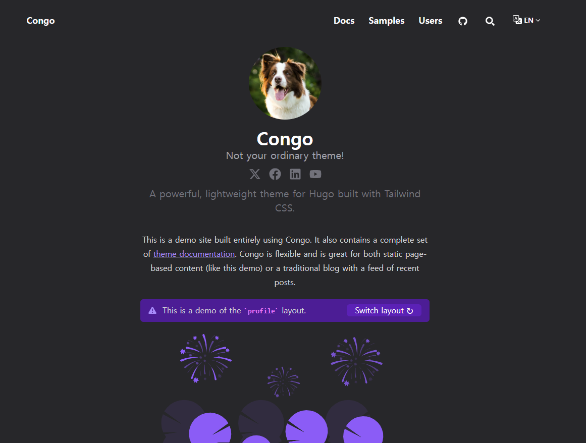

이전에 개발 교육 중 배웠던 것을 작성한 포스트들을 분리시킬 필요성을 느꼈다. 앞으로 블로그를 얼마나 관리를 잘 할 수 있을지는 미지수지만, 정리를 하는 김에 `jekyll`에서 `hugo`로 엔진을 바꾸기로 결심했다.

이유는 간단, hugo 템플릿 디자인이 훨씬 예뻤기 때문이다.
이번에 바꾸게되면 오래 써보자는 결심을 다지고 최근 업데이트 여부 및 데이터 표현의 자유도, 리스트 구조 등 나름 세심히 따져가며 템플릿을 골랐다. 

그렇게 고른 템플릿은 `congo` 

사실 gray + purple 이라는 색조합이 첫번째 선택 이유였지만, `mermaid`와 코드블럭 하이라이트 스타일, 그리고

바로 이 `alert` 지원이 그 이유였다. 

숲보다 나무에 꽂히는 나였다. 

템플릿을 다운받은 나는 광활한 회색 배경과 그 안에 navbar만 있는 텅-빈 페이지를 보며 갑자기 밀려오는 막막한 심정을 어찌할 지 몰랐다.

우선은 보기도 좋은 떡기 먹기에도 좋다고. 내가 열심히 블로그를 하기 위한 선제 조건은, 쓸 맛이 나게끔 커스텀해야한다는 것이다. 

* Pretendard 폰트 적용
* 로고 이미지 제작 (어디서 많이 본 느낌이 든다면 - 맞다)
* 메인 페이지 Tag 키워드로 최신 글목록 조회 (반응형 최적화 필요)
* 이전 블로그 내용을 DevLearn에 배치 (반응형 최적화 필요)

커스텀하면서 좀 헤맸던 부분이 있는데, 이건 `hugo`로 분류를 만들어 포스트를 작성하려고한다. 그리고 앞으로 개발 포스트는 Blog에 작성할 것이다.

음.. 몇몇 커스텀 페이지들은 아직 반응형 최적화가 안되어있다. 당장은 어쩔 수 없고, 차차 바꾸어 나갈 것이다.

