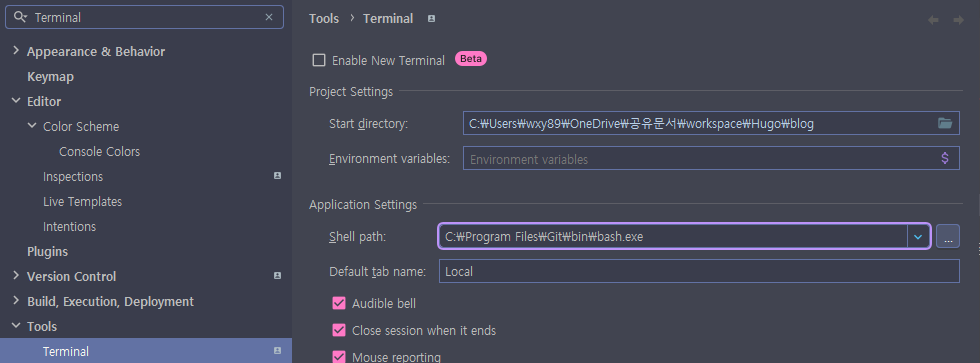

노트북에서 데스크탑으로 데이터를 옮기는 과정에서 Hugo 엔진 설치를 놓쳤다.

추후 검색하는 일을 줄이기 위해 기록해둔다. 이 과정은 go.mod, go.set 등 기본 세팅된 파일이 있는 상태에서 진행했다.


우선 인텔리제이에 Git bash 부터 설정해야했다.


1. [git 설치 (Window용)](https://gitforwindows.org/) : 윈도우용으로 다운받았기 때문에 특별한 설정 변경없이 next만 눌러 설치했다.
2. 인텔리제이 > Setting > Terminal 검색 > `Shell Path` 에 설치한 bash 경로 설정



OK > 인텔리제이 재시작 > 터미널을 실행

Git bash가 적용된 것을 볼 수 있다.


### Go 언어 설치

Go 언어는 Hugo의 기반 언어로 필수로 설치해야한다. 

1. [Go 설치](https://go.dev/dl/) : 운영체제에 맞게 다운했으므로 next로만 설치.
2. Go 설치 확인

```shell
$ go version
go version go1.22.5 windows/amd64
```

### Hugo 엔진 설치

현재 내가 쓰는 테마 `congo`는 Extended 버전으로 설치해야한다. (일반 버전으로 설치하면 오류가 발생한다.)

```shell
# winget : Windows Package Manager
# > Windows 10 이상에서 소프트웨어 패키지를 검색, 설치, 업그레이드, 삭제, 구성
winget install Hugo.Hugo.Extended

# 이후 사용 조건과 개인 정보 보호 정책에 동의 묻는 요청에 'y' 입력
```

### 의존성 설치

Hugo를 설치한 후 `go.sum` 파일 데이터가 손실 될수 있는데, 아래 명령어를 실행하여 필요한 데이터를 다시 받아 올 수 있다.

```shell
# 모듈의 종속성을 정리하고, 필요한 데이터를 다시 다운로드하여 go.sum 파일을 갱신
hugo mod tidy
```


### Hugo 서버 실행

```shell
# 1 
hugo server

# 2 
# config.toml 에 정의한 baseURL 을 로컬 환경으로 실행 
# 링크 및 리소스 경로가 정확히 처리되는지 확인하기 위해
hugo server --baseURL="http://localhost:1313/"
```